---
## Front matter
lang: ru-RU
title: Лабораторная работа №1
subtitle: Операционные системы
author:
  - Краснова К. Г., НКАбд-05-24
institute:
  - Российский университет дружбы народов, Москва, Россия
date: 23 февраля 2025

## i18n babel
babel-lang: russian
babel-otherlangs: english

## Formatting pdf
toc: false
toc-title: Содержание
slide_level: 2
aspectratio: 169
section-titles: true
theme: metropolis
header-includes:
 - \metroset{progressbar=frametitle,sectionpage=progressbar,numbering=fraction}
---

## Цель работы

Целью данной работы является приобретение практических навыков установки операционной системы на виртуальную машину, настройки минимально необходимых для дальнейшей работы сервисов.

## Задание

1. Создание виртуальной машины
2. Установка операционной системы
3. Работа с операционной системой после установки
4. Установка программного обеспечения для создания документации
5. Дополнительные задания

## Создание виртуальной машины

Я сразу открываю окно приложения Virtualbox, так как устанавливала его при выполнении лабораторных работ в курсе "Архитектура компьютера и операционные системы" раздел "Архитектура компьютера" (рис. 1).

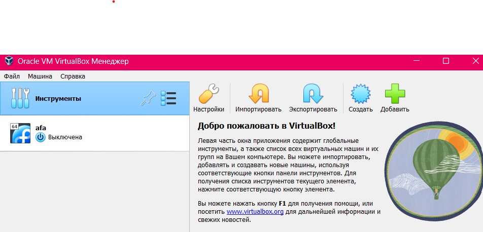{#fig:001 width=70%}

## Создание виртуальной машины

Нажимаю "Создать", создаю новую машину, указываю её имя, путь к папке машины, а также тип и версию (рис. 2).

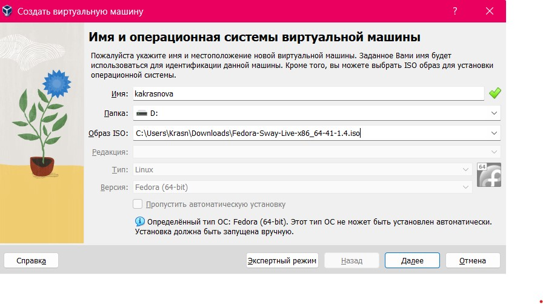{#fig:002 width=70%}

## Создание виртуальной машины

Далее указываю объем памяти 4096МБ и кол-во процессоров (рис. 3).

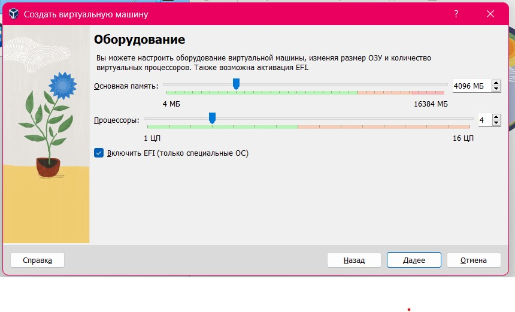{#fig:003 width=70%}

## Создание виртуальной машины

Следом идет настройка жесткого диска. Задаю размер диска 80ГБ и выделяю место в полном размере (рис. 4).

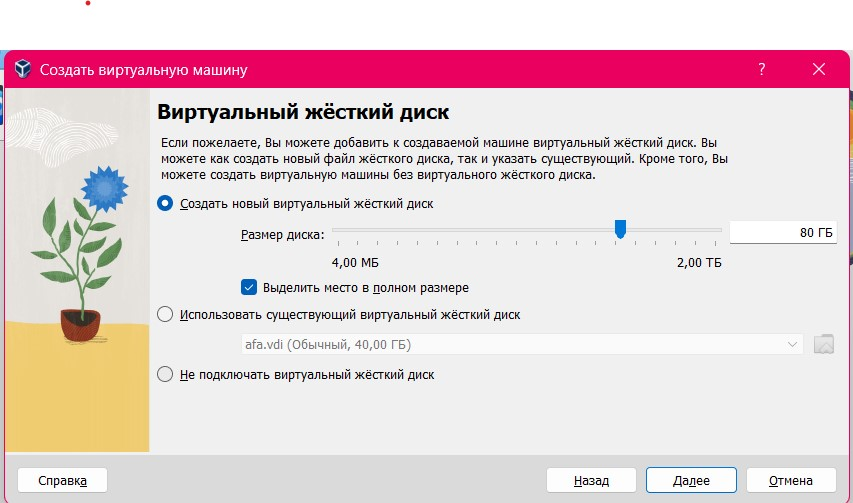{#fig:004 width=70%}

## Создание виртуальной машины

Проверяю настройки машины (рис. 5).

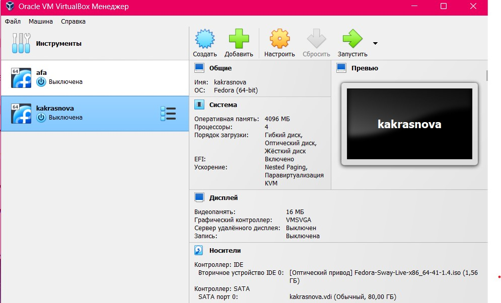{#fig:005 width=70%}

## Создание виртуальной машины

Проверка хост-клавиш (рис. 6).

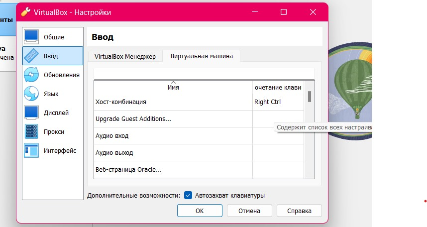{#fig:006 width=70%}

## Создание виртуальной машины

Проверка папки для машин (рис. 7).

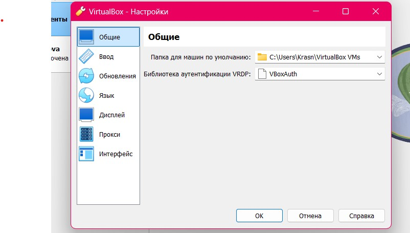{#fig:007 width=70%}

## Установка операционной системы

Запускаю созданную виртуальную машину для установки (рис. 8).

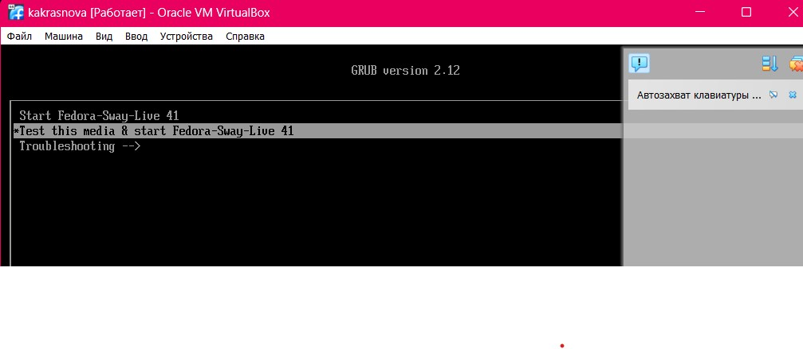{#fig:008 width=70%}

## Установка операционной системы

Нажимаю комбинацию win+enter чтобы запустить терминал. В терминале запускаю liveinst. Перехожу к раскладке окон с табами с помощью win+w, выбираю русский язык и перехожу к настройкам установки операционной системы (рис. 9).

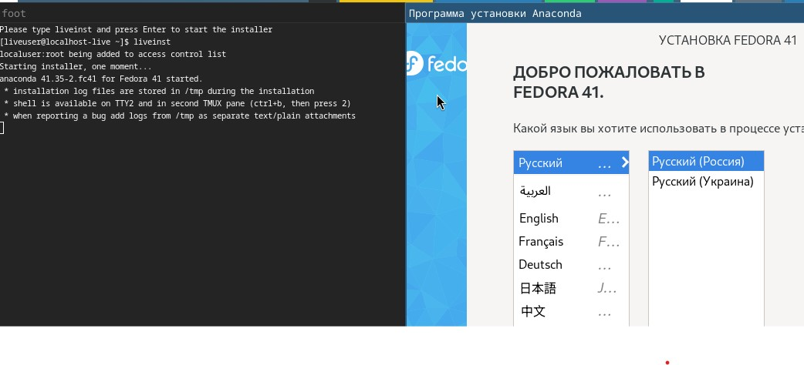{#fig:009 width=70%}

## Установка операционной системы

Редактировать часовой пояс и раскладку клавиатуры не приходится, по умолчанию все стоит верно. Место установки ОС оставляю без изменения. Задаю сетевое имя компьютера (рис. 10).

{#fig:010 width=70%}

## Установка операционной системы

Устанавливаю имя и пароль для пользователя root (рис. 11).

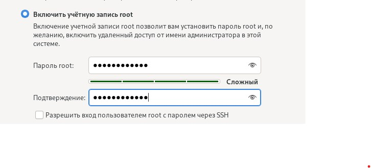{#fig:011 width=70%}

## Установка операционной системы

Устанавливаю имя и пароль для пользователя (рис. 12).

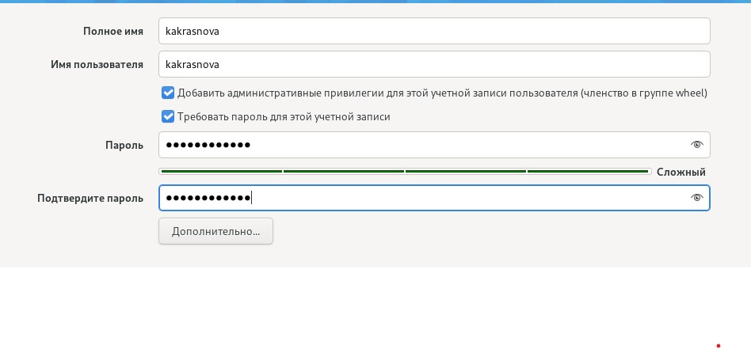{#fig:012 width=70%}

## Установка операционной системы

Завершаем установку операционной системы (рис. 13).

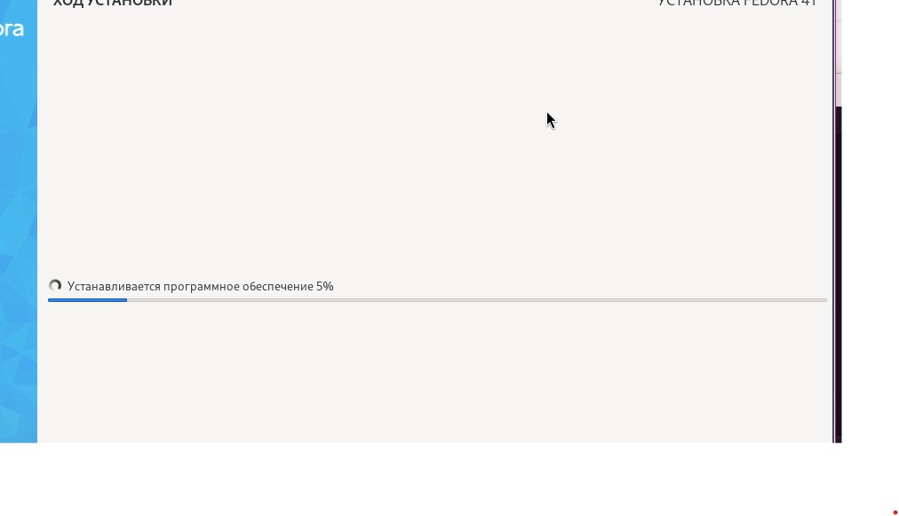{#fig:013 width=70%}

## Установка операционной системы

Перезагрузка виртуальной машины (рис. 14).

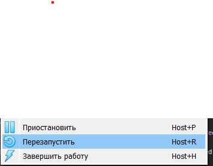{#fig:014 width=70%}

## Работа с операционной системой после установки

Вхожу в ОС под заданной учетной записью. Запускаю терминал и переключаюсь на супер-пользователя. Далее обновляю все пакеты (рис. 15).

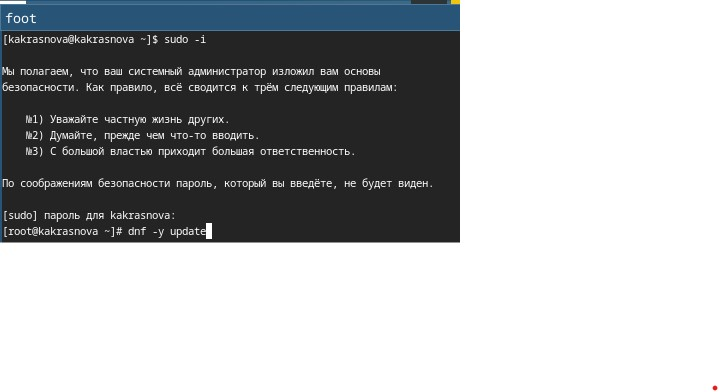{#fig:015 width=70%}

## Работа с операционной системой после установки

Дальше устанавливаю программы для удобства работы в консоли (рис. 16).

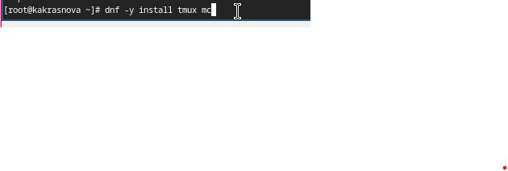{#fig:016 width=70%}

## Работа с операционной системой после установки

Следом устанавливаю программное обеспечение для автоматического обновления (рис. 17).

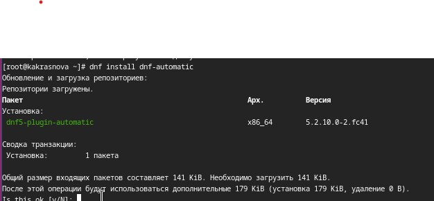{#fig:017 width=70%}

## Работа с операционной системой после установки

Запускаю таймер (рис. 18).

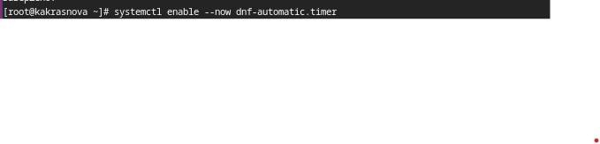{#fig:018 width=70%}

## Работа с операционной системой после установки

Перемещаюсь в директорию /etc/selinux, ищу файл config и заменяю в нем значение SELINUX=enforcing на значение SELINUX=permissive (рис. 19).

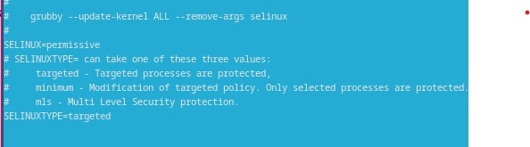{#fig:019 width=70%}

## Работа с операционной системой после установки

Выхожу и сохраняю изменения. Далее перезагружаю виртуальную машину (рис. 20).

{#fig:020 width=70%}

## Работа с операционной системой после установки

Снова захожу в ОС, запускаю терминал и терминальный мультиплексор. Создаю конфигурационный файл 95-system-keyboard-config.conf (рис. 21).

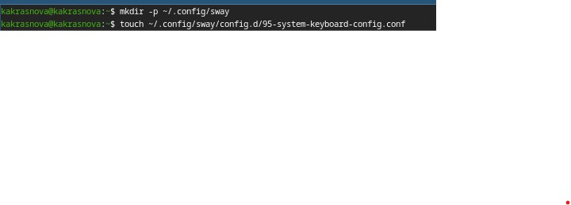{#fig:021 width=70%}

## Работа с операционной системой после установки

Перехожу в директорию ~/.config/sway/config.d и редактирую файл 95-system-keyboard-config.conf (рис. 22).

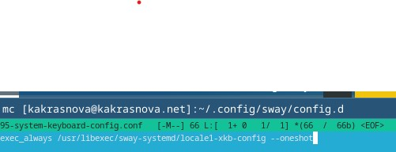{#fig:022 width=70%}

## Работа с операционной системой после установки

Сохраняю изменения и выхожу. Далее переключаюсь на роль супер-пользователя и перехожу в следующую директорию: /etc/X11/xorg.conf.d. Нахожу файл 00-keyboard.conf (рис. 23).

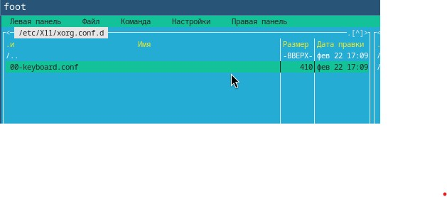{#fig:023 width=70%}

## Работа с операционной системой после установки

Редактирую конфигурационный файл (рис. 24).

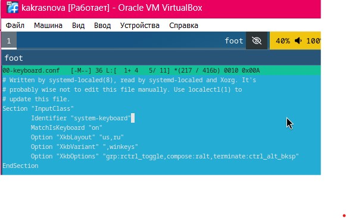{#fig:024 width=70%}

## Работа с операционной системой после установки

И снова перезагружаю виртуальную машину (рис. 25).

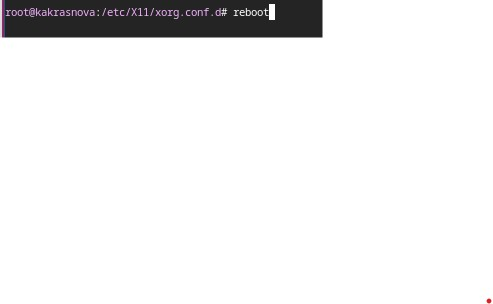{#fig:025 width=70%}

## Работа с операционной системой после установки

Заново захожу в ОС, запускаю терминальный мультиплексор, переключаюсь на роль супер-пользователя и устанавливаю средства разработки (рис. 26).

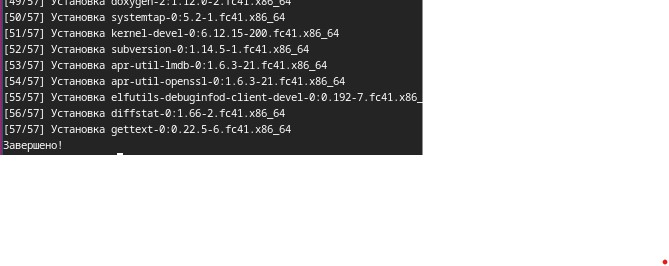{#fig:026 width=70%}

## Работа с операционной системой после установки

Устанавливаю пакет dkms (рис. 27).

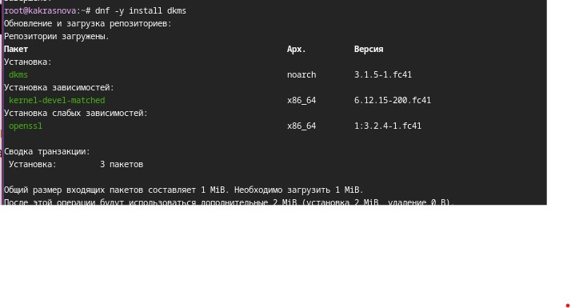{#fig:027 width=70%}

## Работа с операционной системой после установки

Подключаю образ диска дополнений гостевой ОС (рис. 28).

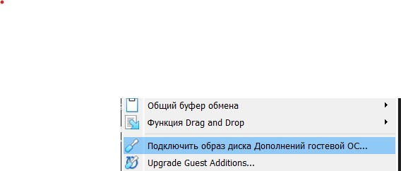{#fig:028 width=70%}

## Работа с операционной системой после установки

Монтирую диск (рис. 29).

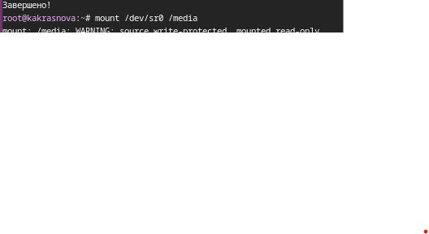{#fig:029 width=70%}

## Работа с операционной системой после установки

Устанавливаю драйвера и перезагружаю виртуальную машину (рис. 30).

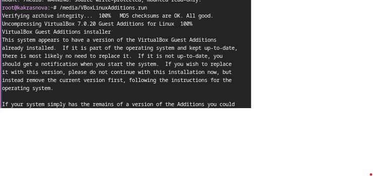{#fig:030 width=70%}

## Установка программного обеспечения для создания документации

Запускаю терминал и терминальный мультиплексор, переключаюсь на роль супер-пользователя. Устанавливаю средство pandoc (рис. 31).

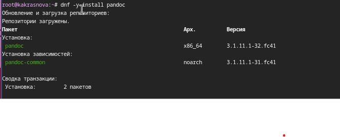{#fig:031 width=70%}

## Установка программного обеспечения для создания документации

Устанавливаю дистрибутив TeXlive (рис. 32).

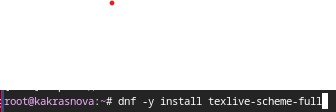{#fig:032 width=70%}

## Выводы

При выполнении даноой дабораторной работы я приобрела навыки установки операционной системы на виртуальную машину, настройки минимально необходимых для дальнейшей работы сервисов.

## Выполнение дополнительного задания

Открываю терминал. Выполняю команду dmesg и анализирую последовательность загрузки системы (рис. 33).

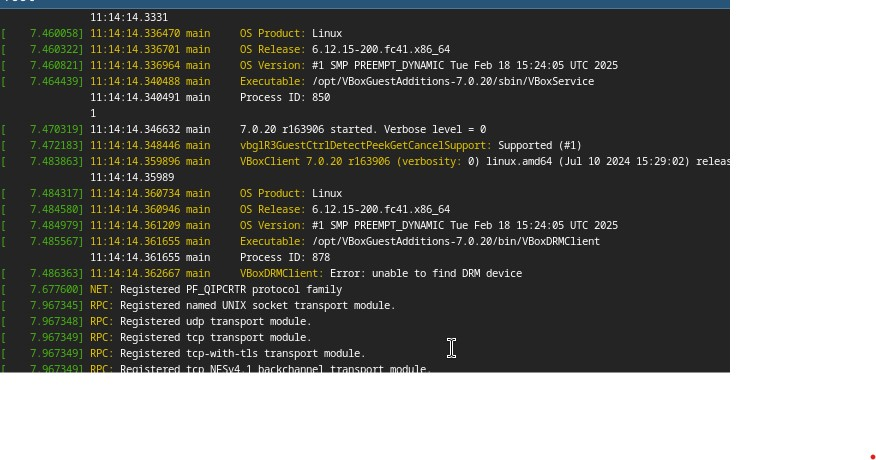{#fig:033 width=70%}

## Выполнение дополнительного задания

Далее с помощью grep нахожу информацию о версии ядра Linux (рис. 34).

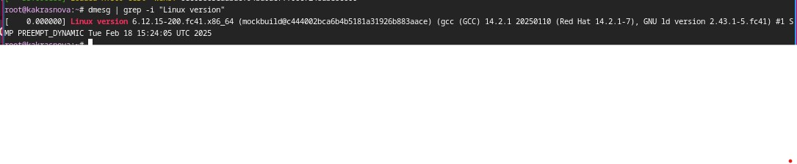{#fig:034 width=70%}

## Выполнение дополнительного задания

Аналогично ищу информацию о частоте процессора (рис. 35).

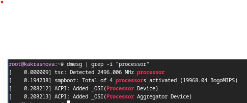{#fig:035 width=70%}

## Выполнение дополнительного задания

Далее нахожу модель процессора (рис. 36).

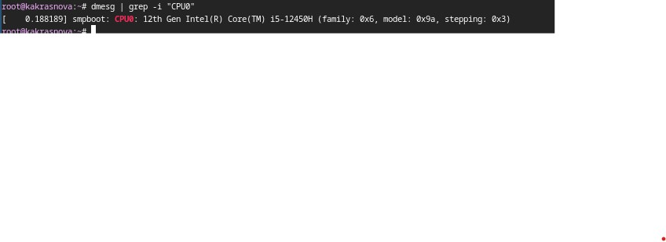{#fig:036 width=70%}

## Выполнение дополнительного задания

Нахожу объем доступной оперативной памяти (рис. 37).

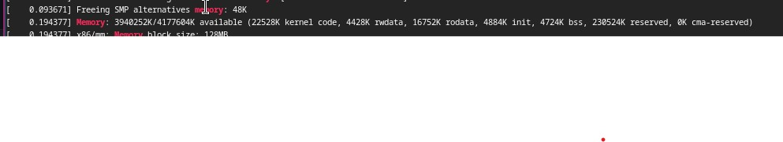{#fig:037 width=70%}

## Выполнение дополнительного задания

Следом ищу тип обнаруженного гипервизора (рис. 38).

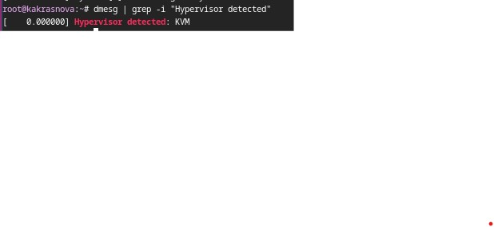{#fig:038 width=70%}

## Выполнение дополнительного задания

Далее смотрим тип файловой системы корневого раздела (рис. 39).

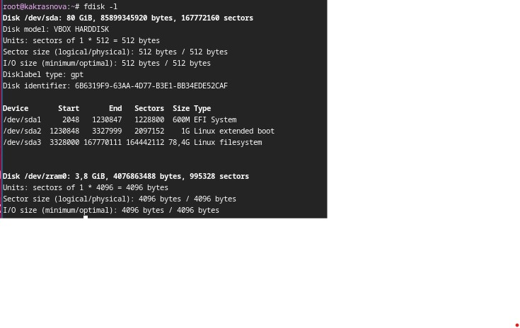{#fig:039 width=70%}

## Выполнение дополнительного задания

И нахожу последовательность монтирования файловых систем (рис. 40).

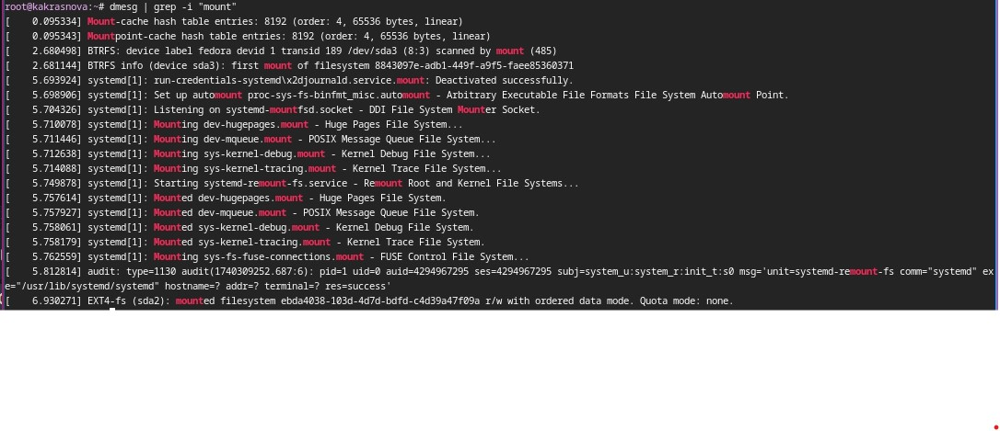{#fig:040 width=70%}

## Список литературы{.unnumbered}

::: {#refs}
1. Dash P. Getting started with oracle vm virtualbox. Packt Publishing Ltd, 2013. 86 p.
2. Colvin H. Virtualbox: An ultimate guide book on virtualization with virtualbox. CreateSpace Independent Publishing Platform, 2015. 70 p.
3. van Vugt S. Red hat rhcsa/rhce 7 cert guide : Red hat enterprise linux 7 (ex200 and ex300). Pearson IT Certification, 2016. 1008 p.
4. Робачевский А., Немнюгин С., Стесик О. Операционная система unix. 2-е изд. Санкт-Петербург: БХВ-Петербург, 2010. 656 p.
5. Немет Э. et al. Unix и Linux: руководство системного администратора. 4-е изд. Вильямс, 2014. 1312 p.
6. Колисниченко Д.Н. Самоучитель системного администратора Linux. СПб.: БХВ-Петербург, 2011. 544 p.
7. Robbins A. Bash pocket reference. O’Reilly Media, 2016. 156 p.
:::
