---
## Front matter
lang: ru-RU
title: Лабораторная работа №2
subtitle: Операционные системы
author:
  - Краснова К. Г.
institute:
  - Российский университет дружбы народов, Москва, Россия
date: 24 февраля 2025

## i18n babel
babel-lang: russian
babel-otherlangs: english

## Formatting pdf
toc: false
toc-title: Содержание
slide_level: 2
aspectratio: 169
section-titles: true
theme: metropolis
header-includes:
 - \metroset{progressbar=frametitle,sectionpage=progressbar,numbering=fraction}
---

## Цель работы

Целью данной лабораторной работы является изучение идеологии и применения средств контроля версий, а также освоение умений по работе с git.

## Задание

1. Создать базовую конфигурацию для работы с git
2. Создать ключ SSH
3. Создать ключ GPG
4. Настроить подписи Git
5. Заргеистрироваться на GitHub
6. Создать локальный каталог для выполнения заданий по предмету.

## Установка программного обеспечения

Захожу в терминал и устанавливаю git, следом устанавливаю gh (рис. 1).

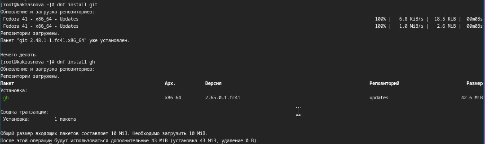{#fig:001 width=70%}

## Базовая настройка git

Задаю имя и email владельца репозитория (рис. 2).

{#fig:002 width=70%}

## Базовая настройка git

Настраиваю utf-8 в выводе сообщений git (рис. 3).

{#fig:003 width=70%}

## Базовая настройка git

Задаю имя начальной ветки (рис. 4).

{#fig:004 width=70%}

## Базовая настройка git

Далее задаю параметры autocrlf и safecrlf (рис. 5).

{#fig:005 width=70%}

## Создание ключей ssh

Создаю ключ размером 4096 бит по алгоритму rsa (рис. 6).

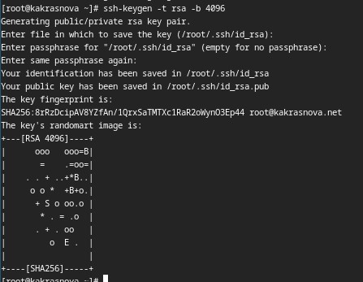{#fig:006 width=70%}

## Создание ключей ssh

Дальше создаю ключ по алгоритму ed25519 (рис. 7).

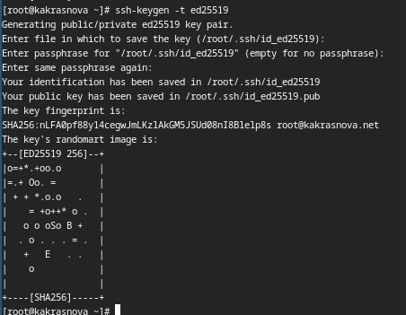{#fig:007 width=70%}

## Создание ключей gpg

Генерирую ключ (рис. 8).

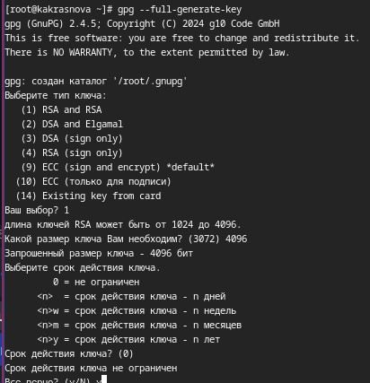{#fig:008 width=70%}

## Создание ключей gpg

И выбираю нужные опции. Подтверждаю и придумываю кодовую фразу (рис. 9).

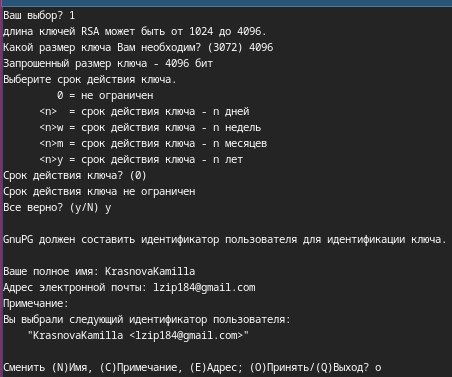{#fig:009 width=70%}

## Настройка github

Учетная запись у меня уже была создана, а также были заполнены основные данные (рис. 10).

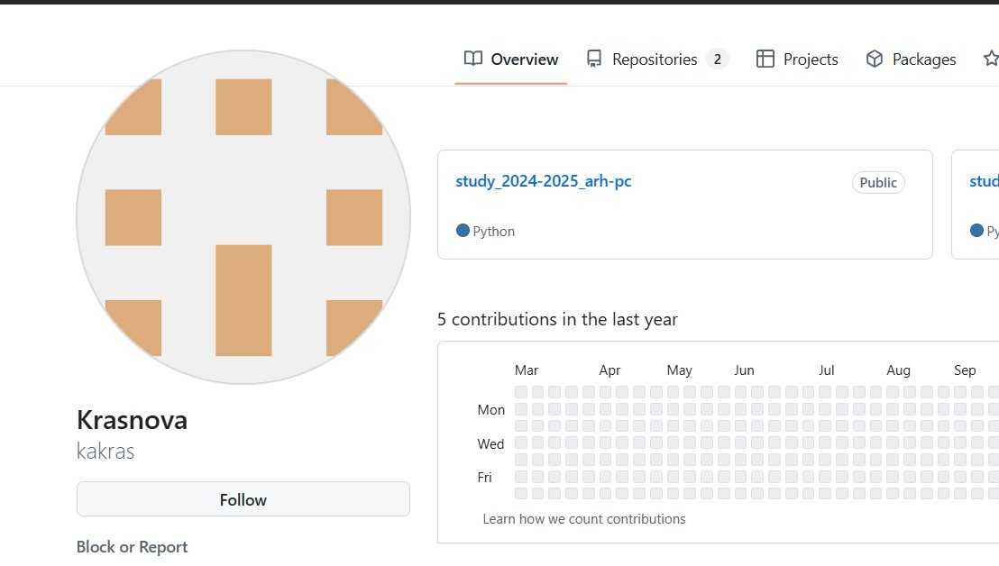{#fig:010 width=70%}

## Добавление gpg ключа в Github

Вывожу список ключей и копирую отпечаток приватного ключа (рис. 11).

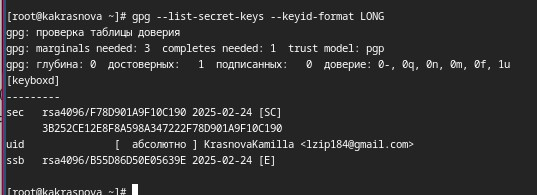{#fig:011 width=70%}

## Добавление gpg ключа в Github

Копирую сгенерированный gpg ключ в буфер обменя и вставляю полученнный ключ в поле ввода в настройках GitHub (рис. 12).

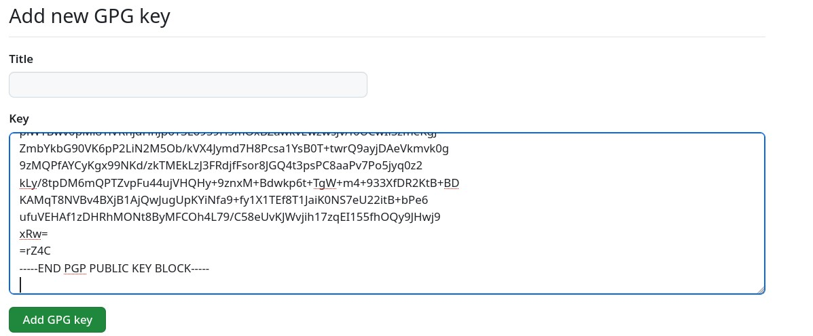{#fig:012 width=70%}

## Добавление gpg ключа в Github

GPG ключ добавился в GitHub (рис. 13).

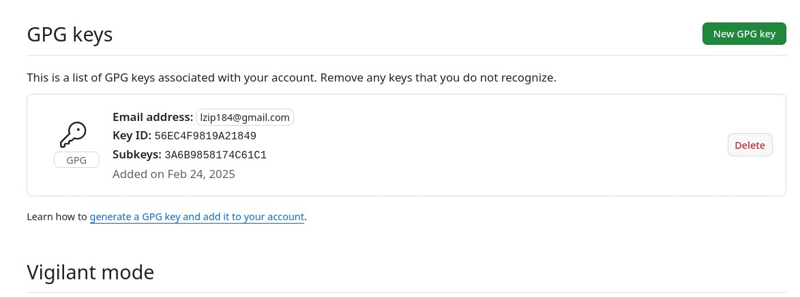{#fig:013 width=70%}

## Настройка автоматических подписей коммитов git

Использую введеный email, указываю Git применять его при подписи коммитов (рис. 14).

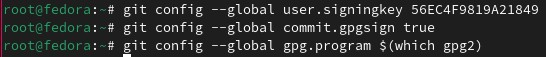{#fig:014 width=70%}

## Настройка gh

Авторизуюсь и отвечаю на несколько наводящих вопросов от утилиты. В конце выбираю авторизацию через токен. Создаю токен на GitHub и вставляю его в терминал. Получаю сообщение об успешной авторизации (рис. 15).

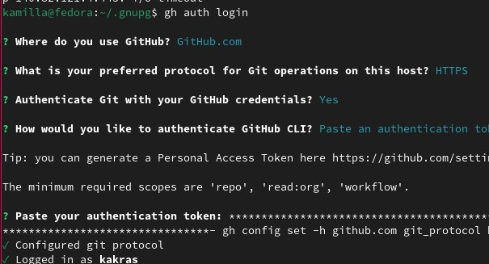{#fig:015 width=70%}

## Создание репозитория курса на основе шаблона

У меня ууже был создан репозиторий курса (рис. 16).

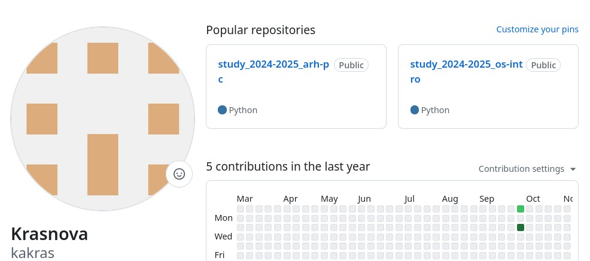{#fig:016 width=70%}

## Настройка каталога курса

Также у меня уже был настроен каталог курса (рис. 17).

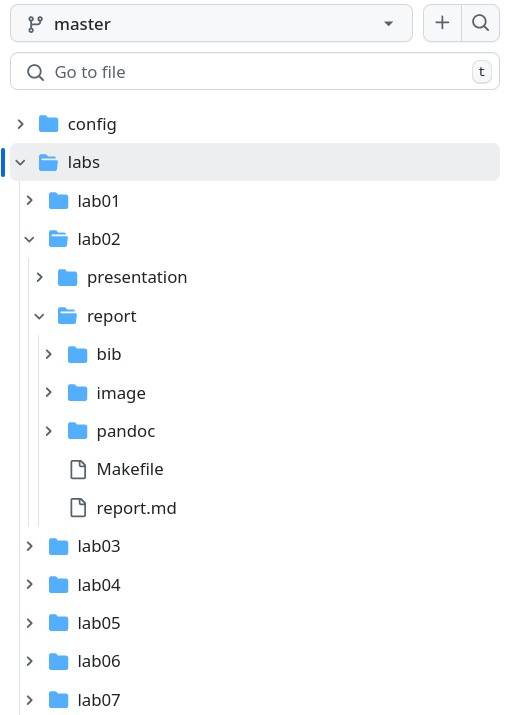{#fig:017 width=70%}

## Выводы

При выполнении данной лабораторной работы я изучила идеологию и применение средств контроля версий, а также освоила умения по работе с git.

## Список литературы{.unnumbered}

::: {#refs}
1. Лабораторная работа № 2 [Электронный ресурс] URL: https://esystem.rudn.ru/mod/page/view.php?id=970819
:::
