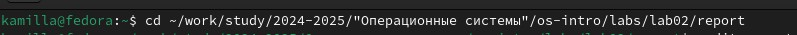
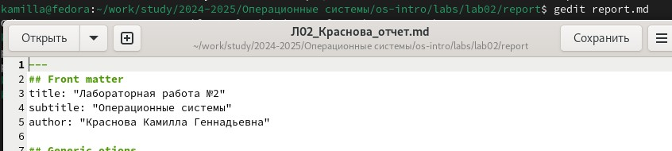
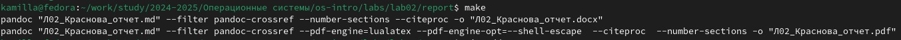
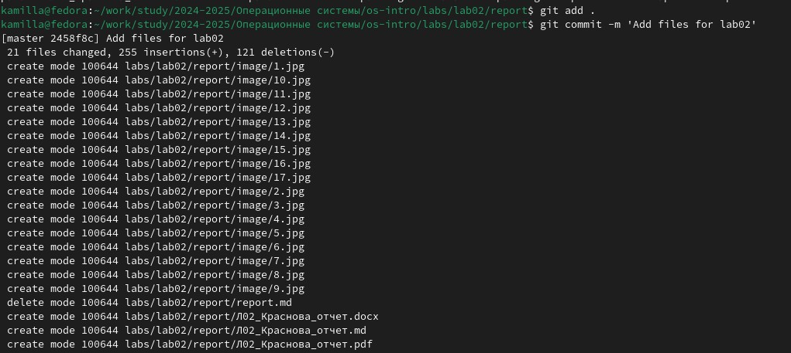
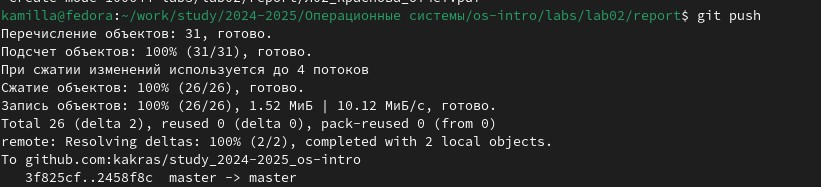

---
## Front matter
lang: ru-RU
title: Лабораторная работа №3
subtitle: Операционные системы
author:
  - Краснова К. Г.
institute:
  - Российский университет дружбы народов, Москва, Россия
date: 25 февраля 2025

## i18n babel
babel-lang: russian
babel-otherlangs: english

## Formatting pdf
toc: false
toc-title: Содержание
slide_level: 2
aspectratio: 169
section-titles: true
theme: metropolis
header-includes:
 - \metroset{progressbar=frametitle,sectionpage=progressbar,numbering=fraction}
---

## Цель работы

Цель данной работы - Научиться оформлять отчёты с помощью легковесного языка разметки Markdown.

## Задание

1. Сделать отчёт по предыдущей лабораторной работе в формате Markdown.
2. В качестве отчёта предоставить отчёты в 3 форматах: pdf, docx и md (в архиве,
поскольку он должен содержать скриншоты, Makefile и т.д.)

## Теоретическое введение

Markdown — облегчённый язык разметки, созданный с целью обозначения форматирования в простом тексте, с максимальным сохранением его читаемости человеком, и пригодный для машинного преобразования в языки для продвинутых публикаций.

## Выполнение лабораторной работы

Перехожу в директорию, в которой располагается шаблон для отчета по лабораторной работе, с помощью утилиты cd (рис. 1).

{#fig:001 width=70%}

## Выполнение лабораторной работы

Открываю файл шаблона с помощью текстового редактора gedit и начинаю заполнять его (рис. 2).

{#fig:002 width=70%}

## Выполнение лабораторной работы

После изменения шаблона я переименовываю его в соответствии требованиями и выполняю его компиляцию в форматы docx и pdf из формата md (рис. 3).

{#fig:003 width=70%}

## Выполнение лабораторной работы

Далее отправляю созданные файлы на глобальный репозиторий (рис. 4).

{#fig:004 width=70%}

## Выполнение лабораторной работы

Завершаю отправку с помощью git push (рис. 5).

{#fig:005 width=70%}

## Выводы

Во время выполнения данной лабораторной работы я научилась оформлять отчеты с помощью легковесного языка разметки Markdown.
