---
## Front matter
lang: ru-RU
title: Лабораторная работа №4
subtitle: Операционные системы
author:
  - Краснова К. Г.
institute:
  - Российский университет дружбы народов, Москва, Россия
date: 03 марта 2025

## i18n babel
babel-lang: russian
babel-otherlangs: english

## Formatting pdf
toc: false
toc-title: Содержание
slide_level: 2
aspectratio: 169
section-titles: true
theme: metropolis
header-includes:
 - \metroset{progressbar=frametitle,sectionpage=progressbar,numbering=fraction}
---

## Цель работы

Целью данной лабораторной работы является получение навыков правильной работы с репозиториями git.

##  Задание

1. Выполнить работу для тестового репозитория.
2. Преобразовать рабочий репозиторий в репозиторий с git-flow и conventional commits.

## Выполнение лабораторной работы

Для начала устанавливаю репозиторий copr (рис. 1).

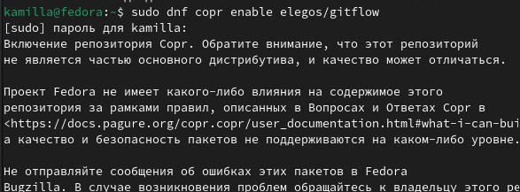{#fig:001 width=70%}
 
## Выполнение лабораторной работы
 
И устанавливаю сам git-flow (рис. 2).

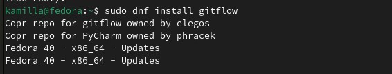{#fig:002 width=70%}
 
## Выполнение лабораторной работы

Устанавливаю node.js (рис. 3).

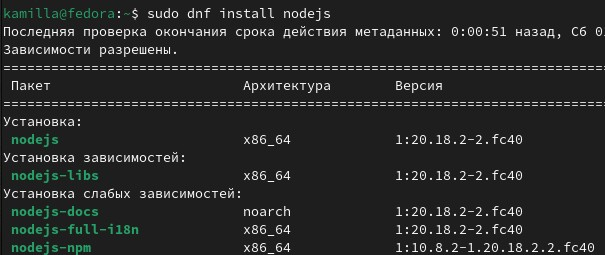{#fig:003 width=70%}

## Выполнение лабораторной работы

И затем устанавливаю pnpm (рис. 4).

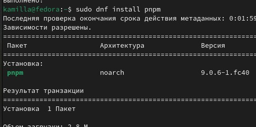{#fig:004 width=70%}

## Выполнение лабораторной работы

апускаю pnpm и выполняю 'source ~/.bashrc (рис. 5).

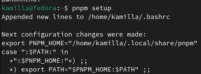{#fig:005 width=70%}

## Выполнение лабораторной работы

Использую программу commitizen для помощи в форматировании коммитов (рис. 6).

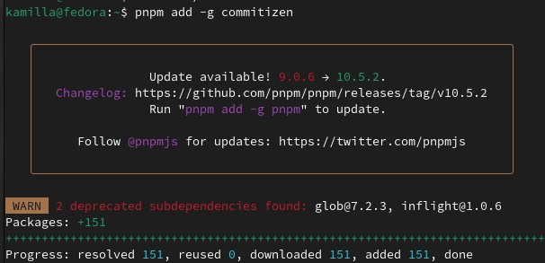{#fig:006 width=70%}

## Выполнение лабораторной работы

Далее использую программу standard-changelog, которая помогает в создании логов (рис. 7).

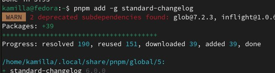{#fig:007 width=70%}

## Выполнение лабораторной работы

Создаю репозиторий на GitHub с названием git-extended. Делаю первый коммит и выкладываю на github (рис. 8).

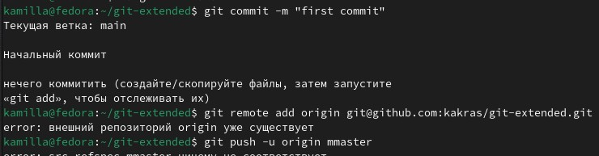{#fig:008 width=70%}

## Выполнение лабораторной работы

Прописываю команду pnpm init, затем перехожу в директорию, в которой находится файл package.json (рис. 9).

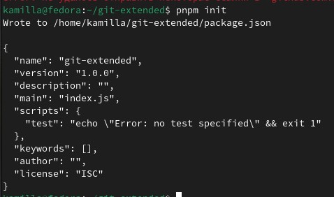{#fig:009 width=70%}

## Выполнение лабораторной работы

С помощью текстового редактора я заполняю несколько параметров пакета. После изменения он выглядит следующи образом: (рис. 10).

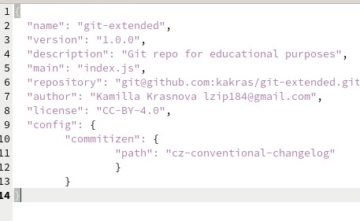{#fig:010 width=70%}

## Выполнение лабораторной работы

Дальше я добавляю новые файлы и выполняю коммит, после чего отвечаю на пару наводящих вопросов и отправляю все на github (рис. 11).

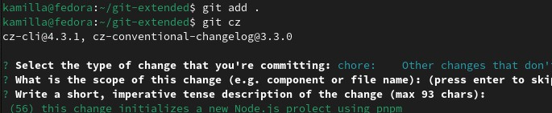{#fig:011 width=70%}

## Выполнение лабораторной работы

Далее инициализирую git-flow. Префикс для ярлыков устанавливаю в v (рис. 12).

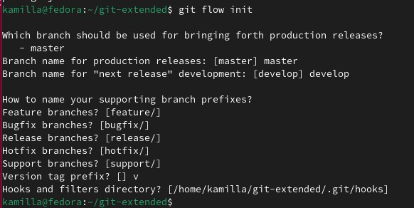{#fig:012 width=70%}

## Выполнение лабораторной работы

Проверяю что я на ветке develop (рис. 13).

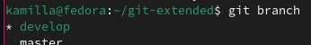{#fig:013 width=70%}

## Выполнение лабораторной работы

Загружаю весь репозиторий в хранилище (рис. 14).

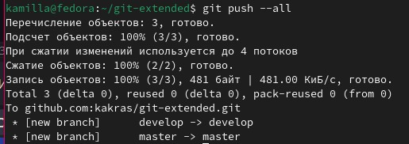{#fig:014 width=70%}

## Выполнение лабораторной работы

Устанавливаю внешнюю ветку как вышестоящую для этой ветки. Далее создаю релиз с версией 1.0.0 (рис. 15).

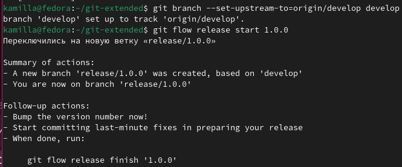{#fig:015 width=70%}

## Выполнение лабораторной работы

Создаю журнал изменений (рис. 16).

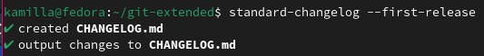{#fig:016 width=70%}

## Выполнение лабораторной работы

Добавляю журнал измененинй в индекс (рис. 17).

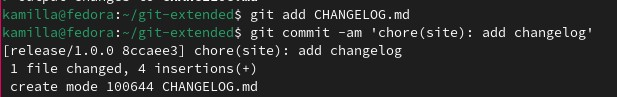{#fig:017 width=70%}

## Выполнение лабораторной работы

И затем заливаю релизную ветку в основную ветку (рис. 18).

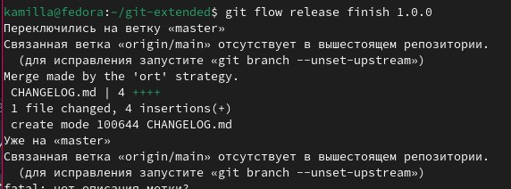{#fig:018 width=70%}

## Выполнение лабораторной работы

Отправляю данные на github с помощью git push --all(рис. 19).

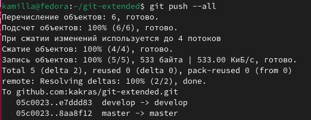{#fig:019 width=70%}

## Выполнение лабораторной работы

Затем с помощью git push --tags(рис. 20).

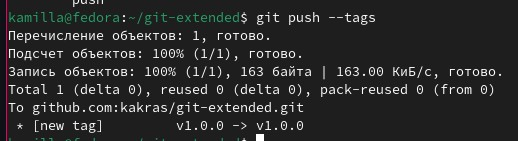{#fig:020 width=70%}

## Выполнение лабораторной работы

И создаю релиз на github, для этого использую утилиты работы с github (рис. 21).

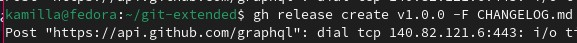{#fig:021 width=70%}

## Выполнение лабораторной работы

Создаю ветку для новой функциональности (рис. 22).

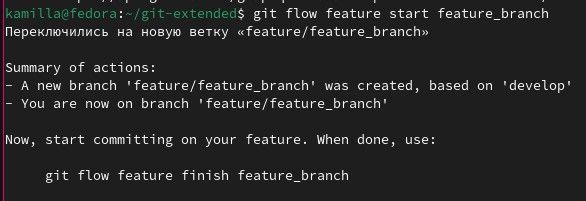{#fig:022 width=70%}

## Выполнение лабораторной работы

Объединаю ветку feature_branch c develop (рис. 23).

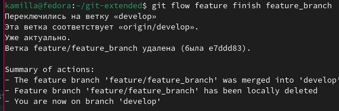{#fig:023 width=70%}

## Выполнение лабораторной работы

Создаю релиз с версией 1.2.3 (рис. 24).

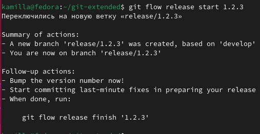{#fig:024 width=70%}

## Выполнение лабораторной работы

С помощью текстового редактора изменяю файл package.json, обновляя номер версии (рис. 25).

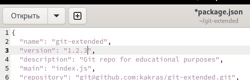{#fig:025 width=70%}

## Выполнение лабораторной работы

Создаю журнал изменений и добавляю его в индекс (рис. 26).

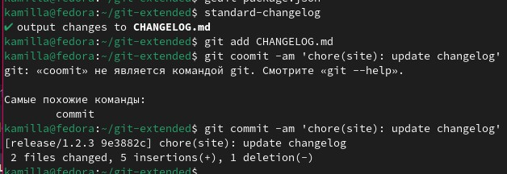{#fig:026 width=70%}

## Выполнение лабораторной работы

Заливаю релизную ветку в основную ветку (рис. 27).

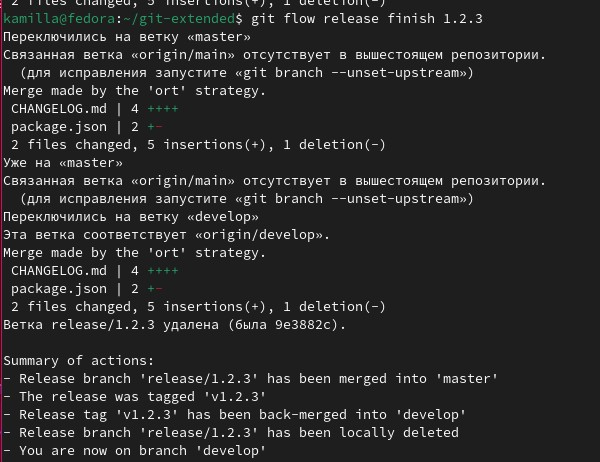{#fig:027 width=70%}

## Выполнение лабораторной работы

Отправляю данные на github с помощью git push --all (рис. 28).

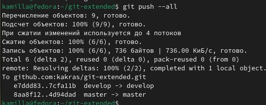{#fig:028 width=70%}

## Выполнение лабораторной работы

Затем с помощью git push --tags (рис. 29).

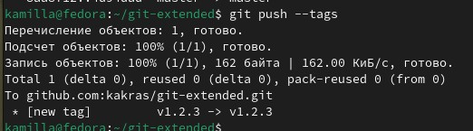{#fig:029 width=70%}

## Выполнение лабораторной работы

Создаю релиз на github с комментариями из журнала изменений (рис. 30).

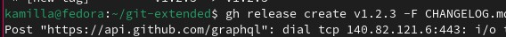{#fig:030 width=70%}

## Выполнение лабораторной работы

Репозиторий git-extended (рис. 31).

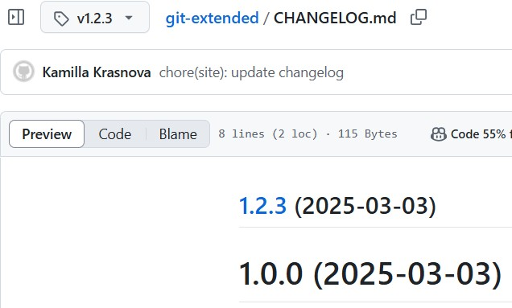{#fig:031 width=70%}

## Выводы

В ходе выполнения данной лабораторной работы я получила навыки правильной работы с репозиториями git.

## Список литературы{.unnumbered}

::: {https://esystem.rudn.ru/mod/page/view.php?id=1098794&forceview=1#org6cf8374%7D}
:::
