---
## Front matter
title: "Лабораторная работа №4"
subtitle: "Операционные системы"
author: "Краснова Камилла Геннадьевна"

## Generic otions
lang: ru-RU
toc-title: "Содержание"

## Bibliography
bibliography: bib/cite.bib
csl: pandoc/csl/gost-r-7-0-5-2008-numeric.csl

## Pdf output format
toc: true # Table of contents
toc-depth: 2
lof: true # List of figures
lot: true # List of tables
fontsize: 12pt
linestretch: 1.5
papersize: a4
documentclass: scrreprt
## I18n polyglossia
polyglossia-lang:
  name: russian
  options:
	- spelling=modern
	- babelshorthands=true
polyglossia-otherlangs:
  name: english
## I18n babel
babel-lang: russian
babel-otherlangs: english
## Fonts
mainfont: IBM Plex Serif
romanfont: IBM Plex Serif
sansfont: IBM Plex Sans
monofont: IBM Plex Mono
mathfont: STIX Two Math
mainfontoptions: Ligatures=Common,Ligatures=TeX,Scale=0.94
romanfontoptions: Ligatures=Common,Ligatures=TeX,Scale=0.94
sansfontoptions: Ligatures=Common,Ligatures=TeX,Scale=MatchLowercase,Scale=0.94
monofontoptions: Scale=MatchLowercase,Scale=0.94,FakeStretch=0.9
mathfontoptions:
## Biblatex
biblatex: true
biblio-style: "gost-numeric"
biblatexoptions:
  - parentracker=true
  - backend=biber
  - hyperref=auto
  - language=auto
  - autolang=other*
  - citestyle=gost-numeric
## Pandoc-crossref LaTeX customization
figureTitle: "Рис."
tableTitle: "Таблица"
listingTitle: "Листинг"
lofTitle: "Список иллюстраций"
lotTitle: "Список таблиц"
lolTitle: "Листинги"
## Misc options
indent: true
header-includes:
  - \usepackage{indentfirst}
  - \usepackage{float} # keep figures where there are in the text
  - \floatplacement{figure}{H} # keep figures where there are in the text
---

# Цель работы

Целью данной лабораторной работы является получение навыков правильной работы с репозиториями git.

# Задание

1. Выполнить работу для тестового репозитория.
2. Преобразовать рабочий репозиторий в репозиторий с git-flow и conventional commits.

# Выполнение лабораторной работы

## Установка программного обеспечения

Для начала устанавливаю репозиторий copr (рис. [-@fig:001]).

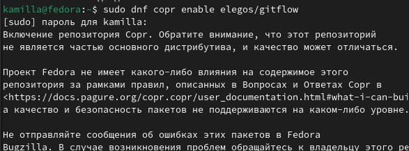{#fig:001 width=70%}

И устанавливаю сам git-flow (рис. [-@fig:002]).

{#fig:002 width=70%}

Устанавливаю node.js (рис. [-@fig:003]).

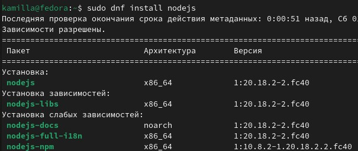{#fig:003 width=70%}

И затем устанавливаю pnpm (рис. [-@fig:004]).

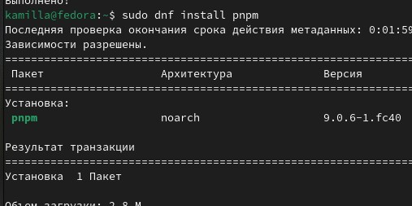{#fig:004 width=70%}

Запускаю pnpm и выполняю 'source ~/.bashrc (рис. [-@fig:005]).

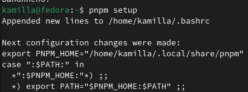{#fig:005 width=70%}

Использую программу commitizen для помощи в форматировании коммитов (рис. [-@fig:006]).

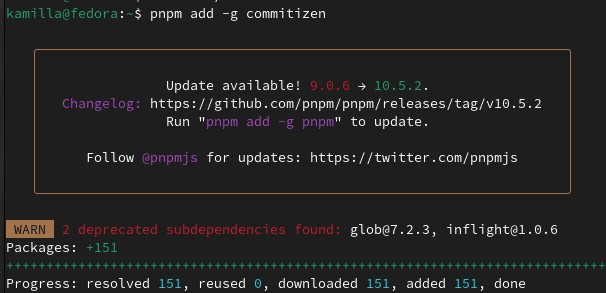{#fig:006 width=70%}

Далее использую программу standard-changelog, которая помогает в создании логов (рис. [-@fig:007]).

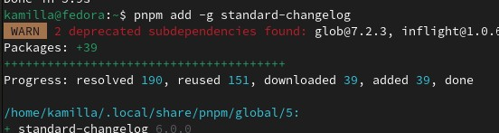{#fig:007 width=70%}

## Практический сценарий использования git

Создаю репозиторий на GitHub с названием git-extended. Делаю первый коммит и выкладываю на github (рис. [-@fig:008]).

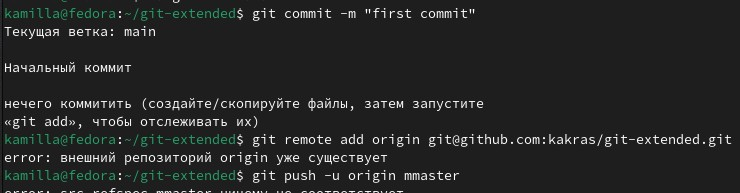{#fig:008 width=70%}

Прописываю команду pnpm init, затем перехожу в директорию, в которой находится файл package.json (рис. [-@fig:009]).

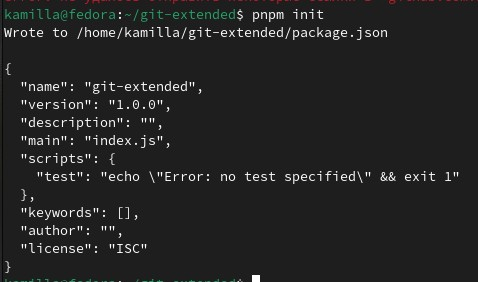{#fig:009 width=70%}

С помощью текстового редактора я заполняю несколько параметров пакета. После изменения он выглядит следующи образом: (рис. [-@fig:010]).

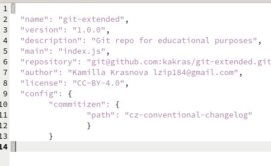{#fig:010 width=70%}

Дальше я добавляю новые файлы и выполняю коммит, после чего отвечаю на пару наводящих вопросов и отправляю все на github (рис. [-@fig:011]).

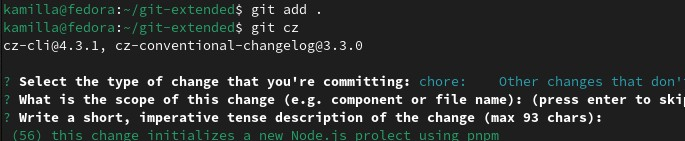{#fig:011 width=70%}

Далее инициализирую git-flow. Префикс для ярлыков устанавливаю в v (рис. [-@fig:012]).

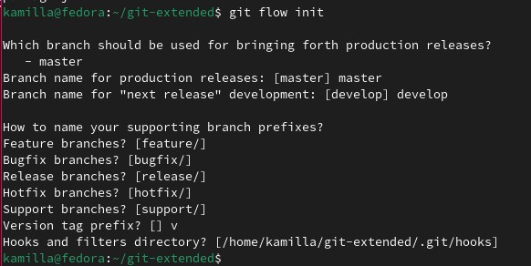{#fig:012 width=70%}

Проверяю что я на ветке develop (рис. [-@fig:013]).

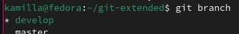{#fig:013 width=70%}

Загружаю весь репозиторий в хранилище (рис. [-@fig:014]).

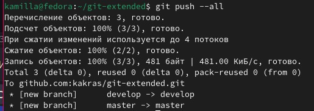{#fig:014 width=70%}

Устанавливаю внешнюю ветку как вышестоящую для этой ветки. Далее создаю релиз с версией 1.0.0 (рис. [-@fig:015]).

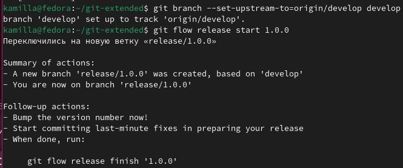{#fig:015 width=70%}

Создаю журнал изменений (рис. [-@fig:016]).

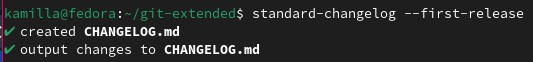{#fig:016 width=70%}

Добавляю журнал измененинй в индекс (рис. [-@fig:017]).

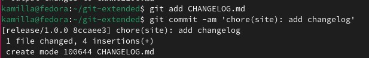{#fig:017 width=70%}

И затем заливаю релизную ветку в основную ветку (рис. [-@fig:018]).

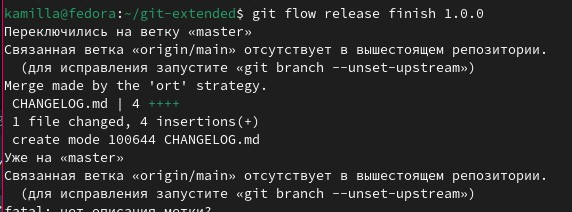{#fig:018 width=70%}

Отправляю данные на github с помощью git push --all(рис. [-@fig:019]).

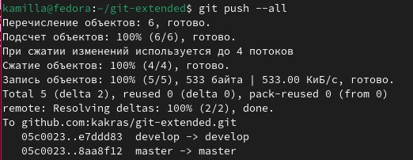{#fig:019 width=70%}

Затем с помощью git push --tags(рис. [-@fig:020]).

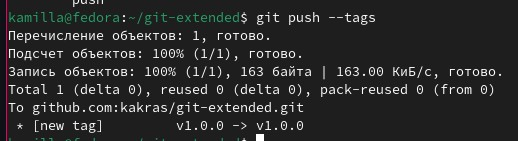{#fig:020 width=70%}

И создаю релиз на github, для этого использую утилиты работы с github (рис. [-@fig:021]).

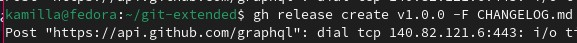{#fig:021 width=70%}

Создаю ветку для новой функциональности (рис. [-@fig:022]).

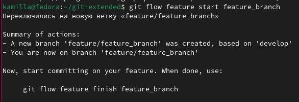{#fig:022 width=70%}

Объединаю ветку feature_branch c develop (рис. [-@fig:023]).

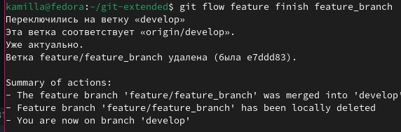{#fig:023 width=70%}

Создаю релиз с версией 1.2.3 (рис. [-@fig:024]).

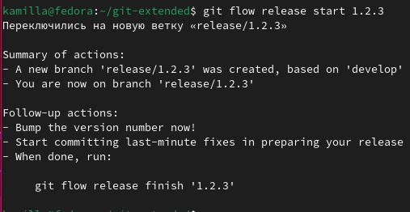{#fig:024 width=70%}

С помощью текстового редактора изменяю файл package.json, обновляя номер версии (рис. [-@fig:025]).

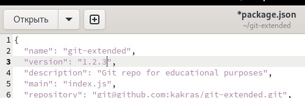{#fig:025 width=70%}

Создаю журнал изменений и добавляю его в индекс (рис. [-@fig:026]).

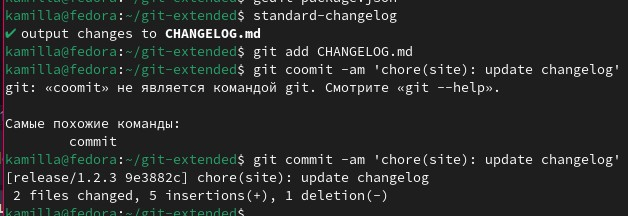{#fig:026 width=70%}

Заливаю релизную ветку в основную ветку (рис. [-@fig:027]).

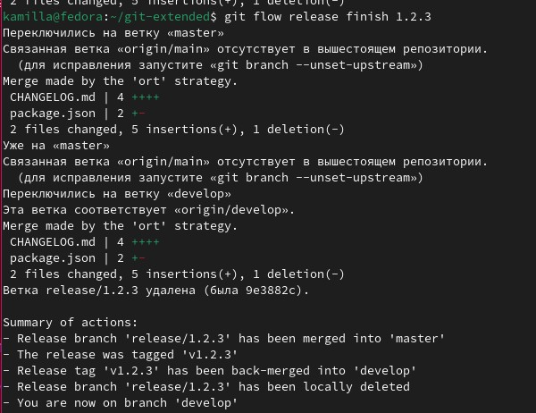{#fig:027 width=70%}

Отправляю данные на github с помощью git push --all (рис. [-@fig:028]).

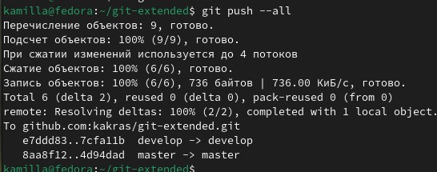{#fig:028 width=70%}

Затем с помощью git push --tags (рис. [-@fig:029]).

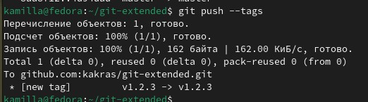{#fig:029 width=70%}

Создаю релиз на github с комментариями из журнала изменений (рис. [-@fig:030]).

{#fig:030 width=70%}

Репозиторий git-extended (рис. [-@fig:031]).

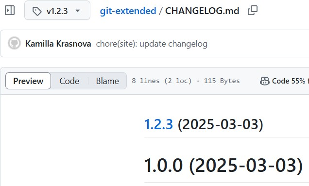{#fig:031 width=70%}

# Выводы

В ходе выполнения данной лабораторной работы я получила навыки правильной работы с репозиториями git.

# Список литературы{.unnumbered}

::: {https://esystem.rudn.ru/mod/page/view.php?id=1098794&forceview=1#org6cf8374%7D}
:::
