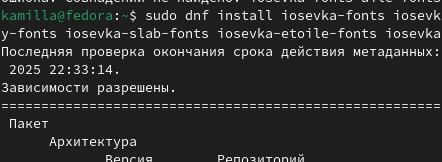

---
## Front matter
title: "Лабораторная работа №5"
subtitle: "Операционные системы"
author: "Краснова Камилла Геннадьевна"

## Generic otions
lang: ru-RU
toc-title: "Содержание"

## Bibliography
bibliography: bib/cite.bib
csl: pandoc/csl/gost-r-7-0-5-2008-numeric.csl

## Pdf output format
toc: true # Table of contents
toc-depth: 2
lof: true # List of figures
lot: true # List of tables
fontsize: 12pt
linestretch: 1.5
papersize: a4
documentclass: scrreprt
## I18n polyglossia
polyglossia-lang:
  name: russian
  options:
	- spelling=modern
	- babelshorthands=true
polyglossia-otherlangs:
  name: english
## I18n babel
babel-lang: russian
babel-otherlangs: english
## Fonts
mainfont: IBM Plex Serif
romanfont: IBM Plex Serif
sansfont: IBM Plex Sans
monofont: IBM Plex Mono
mathfont: STIX Two Math
mainfontoptions: Ligatures=Common,Ligatures=TeX,Scale=0.94
romanfontoptions: Ligatures=Common,Ligatures=TeX,Scale=0.94
sansfontoptions: Ligatures=Common,Ligatures=TeX,Scale=MatchLowercase,Scale=0.94
monofontoptions: Scale=MatchLowercase,Scale=0.94,FakeStretch=0.9
mathfontoptions:
## Biblatex
biblatex: true
biblio-style: "gost-numeric"
biblatexoptions:
  - parentracker=true
  - backend=biber
  - hyperref=auto
  - language=auto
  - autolang=other*
  - citestyle=gost-numeric
## Pandoc-crossref LaTeX customization
figureTitle: "Рис."
tableTitle: "Таблица"
listingTitle: "Листинг"
lofTitle: "Список иллюстраций"
lotTitle: "Список таблиц"
lolTitle: "Листинги"
## Misc options
indent: true
header-includes:
  - \usepackage{indentfirst}
  - \usepackage{float} # keep figures where there are in the text
  - \floatplacement{figure}{H} # keep figures where there are in the text
---

# Цель работы

Целью работы является научиться настраивать рабочую среду.

# Задание

1. Менеджер паролей pass
2. Настройка интерфейса с браузером
3. Сохранение пароля
4. Управление файлами конфигурации
5. Создание собственного репозитория с помощью утилит
6. Подключение репозитория к своей системе
7. Использование chezmoi на нескольких машинах
8. Ежедневные операции c chezmoi

# Теоретическое введение

 Менеджер паролей pass — программа, сделанная в рамках идеологии Unix. Также носит название стандартного менеджера паролей для Unix (The standard Unix password manager).
 Структура базы может быть произвольной, если Вы собираетесь использовать её напрямую, без промежуточного программного обеспечения. Тогда семантику структуры базы данных Вы держите в своей голове.
Если же необходимо использовать дополнительное программное обеспечение, необходимо семантику заложить в структуру базы паролей.

# Выполнение лабораторной работы

## Менеджер паролей pass

 Для начала устанавливаю pass (рис. [-@fig:001]).

{#fig:001 width=70%}

Далее устанавливаю gopass (рис. [-@fig:002]).

{#fig:002 width=70%}

Просматриваю список gpg ключей (рис. [-@fig:003]).

{#fig:003 width=70%}

Инициализирую хранилище с помощью pass init (рис. [-@fig:004]).

{#fig:004 width=70%}

Создаю структуру git (рис. [-@fig:005]).

{#fig:005 width=70%}

Задаю адрес репозитория на хостинге. После этого синхронизирую с помощью git pull (рис. [-@fig:006]).

{#fig:006 width=70%}

И далее синхронизирую с помощью git push (рис. [-@fig:007]).

{#fig:007 width=70%}

Вручную комменчу и выкладываю изменения. Проверяю статус синхронизации (рис. [-@fig:008]).

{#fig:008 width=70%}

## Настройка интерфейса с броузером

Подключаю необходимый репозиторий (рис. [-@fig:009]).

{#fig:009 width=70%}

Далее устанавливаю программу, обеспечивающую интерфейс (рис. [-@fig:010]).

{#fig:010 width=70%}

## Сохранение пароля

Добавляю новый пароль (рис. [-@fig:011]).

{#fig:011 width=70%}

Отображаю пароль для указзаного имени файла. Дальше заменяю существующий пароль (рис. [-@fig:012]).

{#fig:012 width=70%}

## Управление файлами конфигурации

Устанавливаю дополнительное ПО (рис. [-@fig:013]).

{#fig:013 width=70%}

Подключаю репозиторий (рис. [-@fig:014]).

{#fig:014 width=70%}

Выполняю поиск необходимого пакета (рис. [-@fig:015]).

{#fig:015 width=70%}

Устанавливаю шрифты (рис. [-@fig:016]).

{#fig:016 width=70%}

Устанавливаю бинарный файл (рис. [-@fig:017]).

{#fig:017 width=70%}

## Создание собственного репозитория с помощью утилит

Создаю репозиторий для конфигурационных файлов на основе шаблона (рис. [-@fig:018]).

{#fig:018 width=70%}

## Подключение репозитория к своей системе

Инициализирую chezmoi со своим репозиторием dotfiles (рис. [-@fig:019]).

{#fig:019 width=70%}

Проверяю какие изменения внес chezmoi в домашний каталог и запускаю chezmoi apply -v (рис. [-@fig:020]).

{#fig:020 width=70%}

## Использование chezmoi на нескольких машинах

На второй машине инициализирую chezmoi со своим репозиторием dotfiles рис. [-@fig:021]).

{#fig:021 width=70%}

Проверяю какие изменения он внес в домашний каталог. Запускаю chezmoi apply -v, получаю и применяю последние изменения из своего репозитория рис. [-@fig:022]).

{#fig:022 width=70%}

Устанавливаю свои dotfiles на новый компьютер рис. [-@fig:023]).

{#fig:023 width=70%}

## Ежедневные операции c chezmoi

Извлекаю последние изменения из своего репозитория и смотрю, что изменилось, далее применяю их рис. [-@fig:024]).

{#fig:024 width=70%}

Изменяю файл конфигурации, чтобы включить фиксацию изменений рис. [-@fig:025]).

{#fig:025 width=70%}

# Выводы

В ходе выполнения данной лабораторной работы я научилась настраивать рабочую среду.

