---
## Front matter
lang: ru-RU
title: Лабораторная работа №6
subtitle: Операционные системы
author:
  - Краснова К. Г.
institute:
  - Российский университет дружбы народов, Москва, Россия
date: 17 марта 2025

## i18n babel
babel-lang: russian
babel-otherlangs: english

## Formatting pdf
toc: false
toc-title: Содержание
slide_level: 2
aspectratio: 169
section-titles: true
theme: metropolis
header-includes:
 - \metroset{progressbar=frametitle,sectionpage=progressbar,numbering=fraction}
---

## Цель работы

Целью данной лабораторной работы является приобретение практических навыков взаимодействия пользователя с системой посредством командной строки.

## Задание

1. Определить полное имя домашнего каталога.
2. Выполнить следующие действия:
- Перейти в каталог /tmp.
- Вывести на экран содержимое каталога /tmp.
- Определить, есть ли в каталоге /var/spool подкаталог с именем cron.
- Перейти в домашний каталог и вывести на экран его содержимое. Определить, кто является владельцем файлов и подкаталогов.
3. Выполнить следующие действия:
- В домашнем каталоге создать новый каталог с именем newdir.
- В каталоге ~/newdir создать новый каталог с именем morefun.
- В домашнем каталоге создать одной командой три новых каталога с именами letters, memos, misk. Затем удалить эти каталоги одной командой.
- Попробовать удалить ранее созданный каталог ~/newdir командой rm. Проверть, был ли каталог удалён.
- Удалить каталог ~/newdir/morefun из домашнего каталога. Проверить, был ли каталог удалён.

## Задание

4. С помощью команды man определить, какую опцию команды ls нужно использовать для просмотра содержимого не только указанного каталога, но и подкаталогов, входящих в него.
5. С помощью команды man определить набор опций команды ls, позволяющий отсортировать по времени последнего изменения выводимый список содержимого каталога с развёрнутым описанием файлов.
6. Использовать команду man для просмотра описания следующих команд: cd, pwd, mkdir, rmdir, rm. Поясните основные опции этих команд.
7. Используя информацию, полученную при помощи команды history, выполнить модификацию и исполнение нескольких команд из буфера команд.

## Теоретическое введение

Командой в операционной системе называется записанный по специальным правилам текст (возможно с аргументами), представляющий собой указание на выполнение какой-либо функций (или действий) в операционной системе. Обычно первым словом идёт имя команды, остальной текст — аргументы или опции, конкретизирующие действие.
Общий формат команд можно представить следующим образом:
<имя_команды><разделитель><аргументы>
Файловая система ОС типа Linux — иерархическая система каталогов, подкаталогов и файлов, которые обычно организованы и сгруппированы по функциональному признаку. Самый верхний каталог в иерархии называется корневым и обозначается символом /. Корневой каталог содержит системные файлы и другие каталоги.

## Выполнение лабораторной работы

Определяю полное имя своего домашнего каталога с помощью pwd (рис. 1).

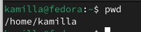{#fig:001 width=70%}

## Выполнение лабораторной работы

Перехожу в каталог /tmp (рис. 2).

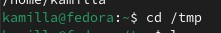{#fig:002 width=70%}

## Выполнение лабораторной работы

Просматриваю содержимое каталога с помощью ls пока что без каких-либо опций (рис. 3).

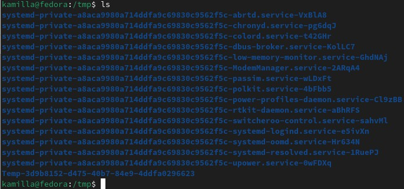{#fig:003 width=70%}

## Выполнение лабораторной работы

Пробую прописать команду ls -l. Опция -l позволяет увидеть информацию о файлах, такую как время создания, владельца и права доступа (рис. 4).

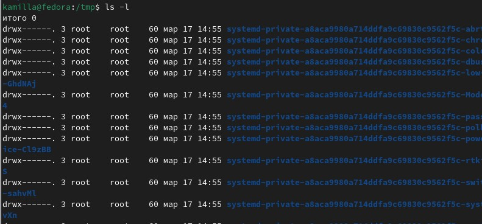{#fig:004 width=70%}

## Выполнение лабораторной работы

Опция -а поможет увидеть скрытые файлы в каталоге (рис. 5).

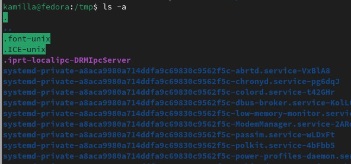{#fig:005 width=70%}

## Выполнение лабораторной работы

Перехожу в директорию /var/spool. Пользуюсь утилитой ls, чтобы просмотреть файлы и подкаталоги каталога. В директории нет такого каталога (рис. 6).

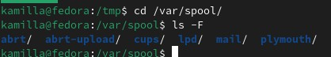{#fig:006 width=70%}

## Выполнение лабораторной работы

Возвращаюсь в домашний каталог. Затем проверяю содержимое каталога. Опция -l определяет владельцев файлов, опция -а показывает все содержимое каталога, а -F помогает определить, что из перечисленного является каталогом (рис. 7).

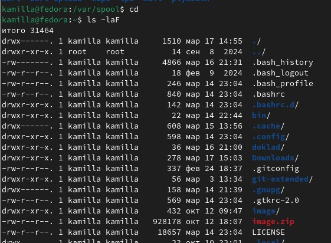{#fig:007 width=70%}

## Выполнение лабораторной работы

В домашнем каталоге создаю новый каталог с именем newdir (рис. 8).

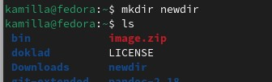{#fig:008 width=70%}

## Выполнение лабораторной работы

В каталоге ~/newdir создаю новый каталог с именем morefun (рис. 9).

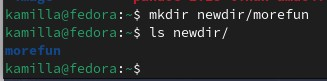{#fig:009 width=70%}

## Выполнение лабораторной работы

В домашнем каталоге создаю одной командой три новых каталога с именами letters, memos, misk (рис. 10).

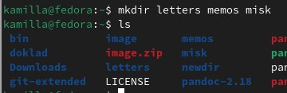{#fig:010 width=70%}

## Выполнение лабораторной работы

Затем удаляю эти каталоги одной командой (рис. 11).

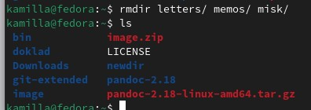{#fig:011 width=70%}

## Выполнение лабораторной работы

Пробую удалить ранее созданный каталог ~/newdir командой rm. Утилита rm по умолчанию удаляет файлы, но не каталоги. Поэтому каталог не удалился (рис. 12).

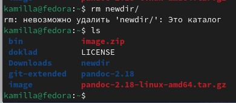{#fig:012 width=70%}

## Выполнение лабораторной работы

Удаляю каталог ~/newdir/morefun из домашнего каталога (рис. 13).

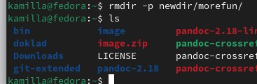{#fig:013 width=70%}

## Выполнение лабораторной работы

С помощью команды man определяю, что для просмотра содержимое не только указанного каталога, но и подкаталогов,
входящих в него необходимо использовать -R (рис. 14).

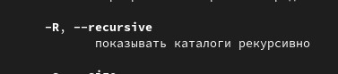{#fig:014 width=70%}

## Выполнение лабораторной работы

С помощью команды man определяю, что для сортировки по времени последнего изменения выводимого списка содержимого каталога с развёрнутым описанием файлов нужно использовать -lt (рис. 15).

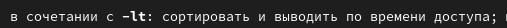{#fig:015 width=70%}

## Выполнение лабораторной работы

С помощью man cd узнаю описание команды cd и ее опции. Основных опций немного (рис. 16).
1. -P - позволяет следовать по символическим ссылкам перед тем, как обработаны все переходы '..'
3. -L - переходит по символическим ссылкам только после того, как обработаны все переходы ".."
4. -e - позволяет выйти с ошибкой, если диреткория, в которую нужно перейти, не найдена.

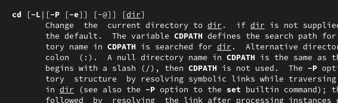{#fig:016 width=70%}

## Выполнение лабораторной работы

С помощью man pwd узнаю описание команды pwd и ее опции (рис. 17).
1. -L - брать директорию из переменной окружения, даже если она содержит символические ссылки.
2. -P - отбрасывать все символические ссылки.

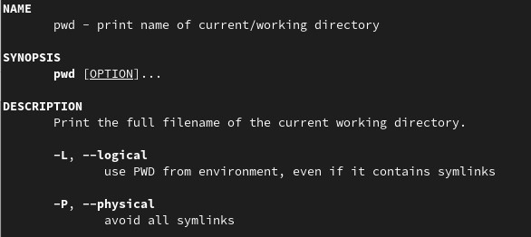{#fig:017 width=70%}

## Выполнение лабораторной работы

С помощью man mkdir узнаю описание команды mkdir и ее опции (рис. 18).
1. -m - устанавливает права доступа создаваемой директории как chmod, синтаксис тоже как у chmod.
2. -p - позволяет рекурсивно создавать директории и их подкаталоги
3. -v - выводи сообщение о созданных директориях
4. -z - установить контекст SELinux для создаваемой директории по умолчанию
5. -context - установить контекст SELinux для создаваемой директории в значении CTX

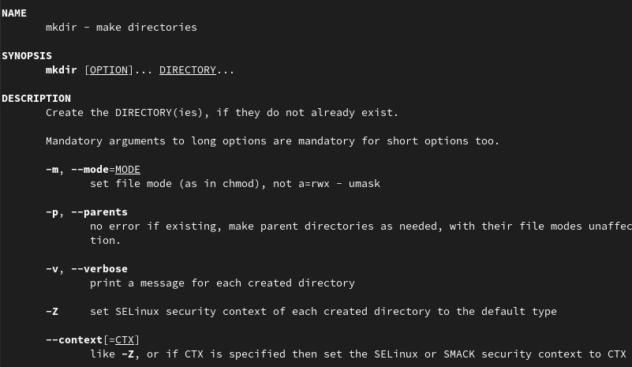{#fig:018 width=70%}

## Выполнение лабораторной работы

С помощью man rmdir узнаю описание команды rmdir и ее опции (рис. 19).
1. --ignore-fail-on-non-empty - отменяет вывод ошибки, если каталог не пустой, просто его игнорирует
2. -p - удаляет рекурсивно каталоги, если они все содержат в себе только удаляемый каталог
3. -v - выводит сообщение о каждом удалении  директории.

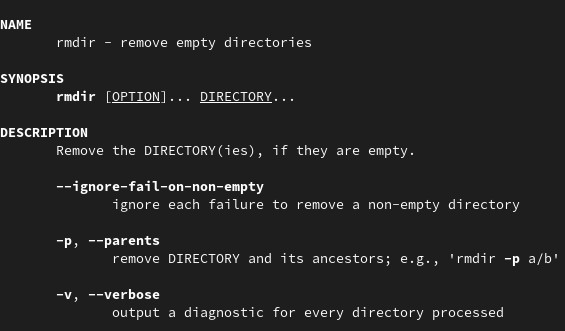{#fig:019 width=70%}

## Выполнение лабораторной работы

С помощью man rm узнаю описание команды rm и ее опции (рис. 20).
1. -f - игнорировать несуществующие файлы или аргументы, никогда не выводить запрос на подтверждение удаления
2. -i - выводить запрос на подтверждение удаления каждого файла
3. -I - вывести запрос на подтверждение удаления один раз, для всех файлов, если удаляется больше 3-х файлов или идет рекурсивное удаление
4. --interactive - заменяет предыдущие три опции, можно выбрать одну из них.
5. --one-file-system - во время рекурсивного удаления пропускать директории из других файловых систем
6. --no-preserve-root если в качестве директории задана корневая, то считать что это обычная директория и начать удаление.
7. -r, -R - удаляет директории их содержимое рекурсивно
8. -d, --dir - удаляет пустые директории
9. -v - прописывает все действия команды

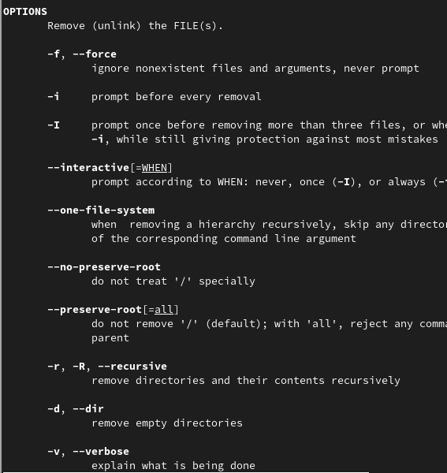{#fig:020 width=70%}

## Выполнение лабораторной работы

Выполняю команду history, чтобы увидеть историю вводимых команд (рис. 21).

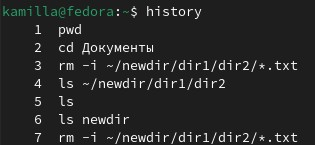{#fig:021 width=70%}

## Выполнение лабораторной работы

Модифицирую и исполняю команду из буфера команд (рис. 22).

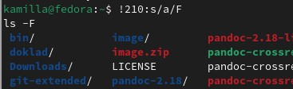{#fig:022 width=70%}

## Выполнение лабораторной работы

Модифицирую и исполняю команду из буфера команд (рис. 23).

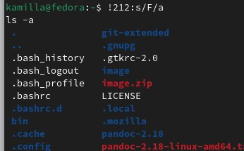{#fig:023 width=70%}

## Выводы

В ходе выполнения данной лабораторной работы я приобрела практические навыки взаимодействия пользователя с системой посредством командной строки.
