---
## Front matter
lang: ru-RU
title: Лабораторная работа №7
subtitle: Операционные системы
author:
  - Краснова К. Г.
institute:
  - Российский университет дружбы народов, Москва, Россия
date: 28 марта 2025

## i18n babel
babel-lang: russian
babel-otherlangs: english

## Formatting pdf
toc: false
toc-title: Содержание
slide_level: 2
aspectratio: 169
section-titles: true
theme: metropolis
header-includes:
 - \metroset{progressbar=frametitle,sectionpage=progressbar,numbering=fraction}
---

## Цель работы

Целью данной лаброаторной работы является ознакомление с файловой системой Linux, её структурой, именами и содержанием каталогов. Приобретение практических навыков по применению команд для работы с файлами и каталогами, по управлению процессами (и работами), по проверке использования диска и обслуживанию файловой системы.

## Задание

1. Выполнение всех команд из описания лабораторной работы.
2. Выполнение действий, связанных с копированием, перемещением и созданием файлов.
3. Определить опции команды chmod.
4. Проделать упражнения, связанные с перемещением, копированием файлов и изменением настроек доступа.
5. Прочитать информацию по командам.

## Теоретическое введение

Каждый файл или каталог имеет права доступа 
В сведениях о файле или каталоге указываются:
– тип файла (символ (-) обозначает файл, а символ (d) — каталог);
– права для владельца файла (r — разрешено чтение, w — разрешена запись, x — разрешено выполнение, - — право доступа отсутствует);
– права для членов группы (r — разрешено чтение, w — разрешена запись, x — разрешено выполнение, - — право доступа отсутствует);
– права для всех остальных (r — разрешено чтение, w — разрешена запись, x — разрешено
выполнение, - — право доступа отсутствует).

## Выполнение лабораторной работы

Создаю файл и копирую его с другим именем (рис. 1).

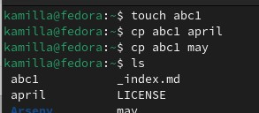{#fig:001 width=70%}

## Выполнение лабораторной работы

Создаю директорию и копирую ее под другими именами (рис. 2).

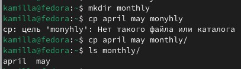{#fig:002 width=70%}

## Выполнение лабораторной работы

Перемещаю файл с измененным именем (рис. 3).

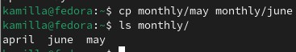{#fig:003 width=70%}

## Выполнение лабораторной работы

Создаю новую директорию. Копирую предыдущую вместе со всем содержимым. Затем коипрую предыдущую директорию в новую (рис. 4).

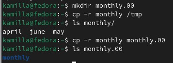{#fig:004 width=70%}

## Выполнение лабораторной работы

Переименовываю файл и перемещаю в каталог (рис. 5).

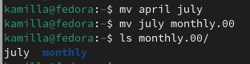{#fig:005 width=70%}

## Выполнение лабораторной работы

Переименовываю директорию и перемещаю одну в другую (рис. 6).

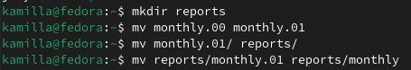{#fig:006 width=70%}

## Выполнение лабораторной работы

Создаю файл, проверяю права доступа, изменяю их, добавляя право на выполнение (рис. 7).

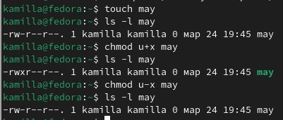{#fig:007 width=70%}

## Выполнение лабораторной работы

Меняю права доступа у директории, запрещаю группам и остальным читать каталог (рис. 8).

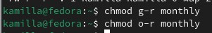{#fig:008 width=70%}

## Выполнение лабораторной работы

Создаю новый пустой файл, даю право доступа, теперь группы могут писать (рис. 9).

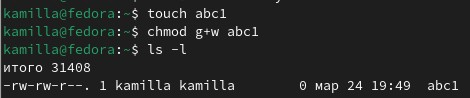{#fig:009 width=70%}

## Выполнение лабораторной работы

Проверяю файловую систему (рис. 10).

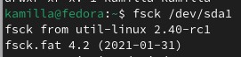{#fig:010 width=70%}

## Выполнение лабораторной работы

Копирую файл в домашний каталог с новым именем, создаю директорию, перемещаю туда файл, затем переименовываю (рис. 11).

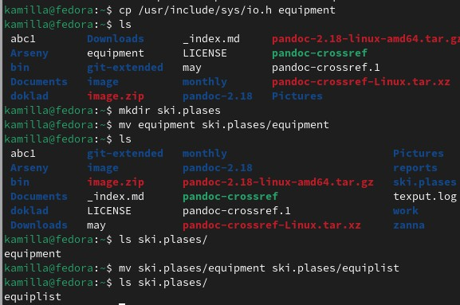{#fig:011 width=70%}

## Выполнение лабораторной работы

Снова создаю файл, копирую его в новую директорию с новым именем. Создаю в каталоге подкаталог и перемещаю туда файлы (рис. 12).

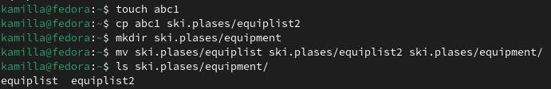{#fig:012 width=70%}

## Выполнение лабораторной работы

Создаю новую директорию, перемещаю ее с новым именем в прошлую директорию (рис. 13).

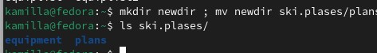{#fig:013 width=70%}

## Выполнение лабораторной работы

Проверяю, как и какие права нужно поменять у новой директории (рис. 14).

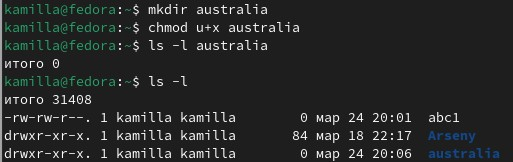{#fig:014 width=70%}

## Выполнение лабораторной работы

Проверяю, как и какие права нужно поменять у новой директории (рис. 15).

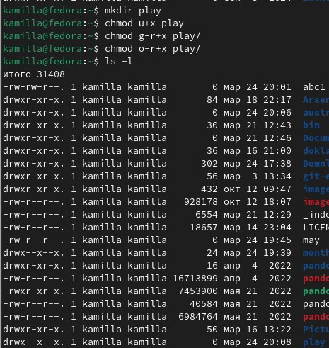{#fig:015 width=70%}

## Выполнение лабораторной работы

Создаю файлы, меняю в них права доступа так, чтобы подходило по заданию (рис. 16).

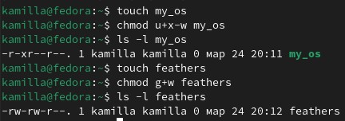{#fig:016 width=70%}

## Выполнение лабораторной работы

Читаю содержимое файла (рис. 17).

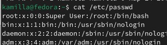{#fig:017 width=70%}

## Выполнение лабораторной работы

Копирую файл с новым именем, перемещаю его в раннее созданный каталог, затем копирую в него другие директории (рис. 18).

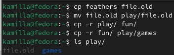{#fig:018 width=70%}

## Выполнение лабораторной работы

Убираю право на чтение у файла, дальше отказываю в праве на выполнение уже у другого файла (рис. 19).

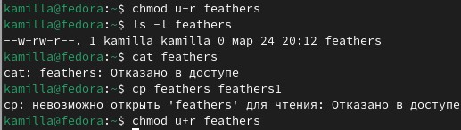{#fig:019 width=70%}

## Выполнение лабораторной работы

Убираю у директории право на исполнение для пользователя, пытаюсь в нее войти - отказано в доступе, возвращаю все права (рис. 20).

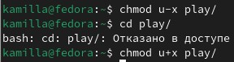{#fig:020 width=70%}

## Выполнение лабораторной работы

Я прочитала описание каждой из четырех команд с помощью man.
- mount — утилита командной строки в UNIX-подобных операционных системах. Применяется для монтирования файловых систем.
- fsck (проверка файловой системы) - это утилита командной строки, которая позволяет выполнять проверки согласованности и интерактивное исправление в одной или нескольких файловых системах Linux. Он использует программы, специфичные для типа файловой системы, которую он проверяет.
- mkfs используется для создания файловой системы Linux на некотором устройстве, обычно в разделе жёсткого диска. В качестве аргумента filesys для файловой системы может выступать или название устройства
- Команда Kill посылает указанный сигнал указанному процессу. Если не указано ни одного сигнала, посылается сигнал SIGTERM. Сигнал SIGTERM завершает лишь те процессы, которые не обрабатывают его приход. Для других процессов может быть необходимым послать сигнал SIGKILL, поскольку этот сигнал перехватить невозможно.

## Выводы

В ходе выполнения данной лабораторной работы я ознакомилась с файловой системой Linux, её структурой, именами и содержанием каталогов. Приобрела практические навыки по применению команд для работы с файлами и каталогами, по управлению процессами (и работами), по проверке использования диска и обслуживанию файловой системы.
