---
## Front matter
lang: ru-RU
title: Лабораторная работа №8
subtitle: Операционные системы
author:
  - Краснова К. Г.
institute:
  - Российский университет дружбы народов, Москва, Россия
date: 30 марта 2025

## i18n babel
babel-lang: russian
babel-otherlangs: english

## Formatting pdf
toc: false
toc-title: Содержание
slide_level: 2
aspectratio: 169
section-titles: true
theme: metropolis
header-includes:
 - \metroset{progressbar=frametitle,sectionpage=progressbar,numbering=fraction}
---

## Цель работы

Целью данной лабораторной работы является ознакомление с инструментами поиска файлов и фильтрации текстовых данных. Приобретение практических навыков: по управлению процессами (и заданиями), по проверке использования диска и обслуживанию файловых систем

## Задание

1. Осуществить вход в систему, используя соответствующее имя пользователя.
2. Записать в файл file.txt названия файлов, содержащихся в каталоге /etc. Дописать в этот же файл названия файлов, содержащихся в домашнем каталоге.
3. Вывести имена всех файлов из file.txt, имеющих расширение .conf, после чего запишите их в новый текстовой файл conf.txt.
4. Определить, какие файлы в домашнем каталоге имеют имена, начинавшиеся с символа c? Несколько вариантов, как это сделать.
5. ВывеСТИ на экран (по странично) имена файлов из каталога /etc, начинающиеся с символа h.

## Задание 

6. ЗапуститЬ в фоновом режиме процесс, который будет записывать в файл ~/logfile файлы, имена которых начинаются с log.
7. Удалить файл ~/logfile.
8. Запустить из консоли в фоновом режиме редактор gedit.
9. Определить идентификатор процесса gedit, используя команду ps, конвейер и фильтр grep.
10. Прочитать справку (man) команды kill, после чего использовать её для завершения процесса gedit.
11. Выполнить команды df и du, предварительно получив более подробную информацию об этих командах, с помощью команды man.
12. Воспользовавшись справкой команды find, вывести имена всех директорий, имеющихся в домашнем каталоге.

## Теоретическое введение

В системе по умолчанию открыто три специальных потока:
– stdin — стандартный поток ввода (по умолчанию: клавиатура), файловый дескриптор 0;
– stdout — стандартный поток вывода (по умолчанию: консоль), файловый дескриптор 1;
– stderr — стандартный поток вывод сообщений об ошибках (по умолчанию: консоль), файловый дескриптор 2.
Большинство используемых в консоли команд и программ записывают результаты своей работы в стандартный поток вывода stdout. Например, команда ls выводит в стандартный поток вывода (консоль) список файлов в текущей директории. Потоки вывода и ввода можно перенаправлять на другие файлы или устройства. Проще всего это делается с помощью символов >, >>, <, <<.

## Выполнение лабораторной работы

Захожу в систему под соответсвующим именем. Записываю в файл file.txt названия файлов, содержащихся в каталоге /etc (рис. 1).

{#fig:001 width=70%}

## Выполнение лабораторной работы

Далее дописываю в файл названия файлов, содержащихся в домашнем каталоге (рис. 2).

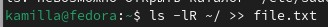{#fig:002 width=70%}

## Выполнение лабораторной работы

Вывожу имена всех фалов из file.txt, имеющих расширение .conf (рис. 3).

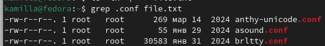{#fig:003 width=70%}

## Выполнение лабораторной работы

После чего записываю эти имена в новый текстовый файл conf.txt (рис. 4).

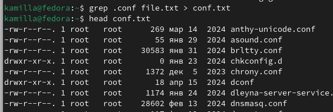{#fig:004 width=70%}

## Выполнение лабораторной работы

Сперва нахожу файлы в домашнем каталоге, которые начинаются с с, с помощью find (рис. 5).

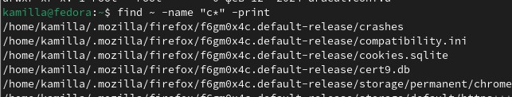{#fig:005 width=70%}

## Выполнение лабораторной работы

Далле произвожу поиск с помощью grep (рис. 6).

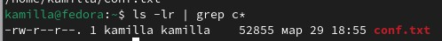{#fig:006 width=70%}

## Выполнение лабораторной работы

Вывожу на экран имена файлов, начинающихся с символа h (рис. 7).

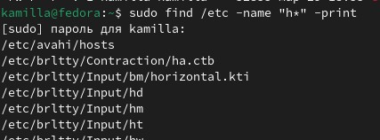{#fig:007 width=70%}

## Выполнение лабораторной работы

Запускаю в фоновом режиме процесс, который будет записывать в файл ~/logfile имена фалов, начинающихся с log (рис. 8).

{#fig:008 width=70%}

## Выполнение лабораторной работы

Удаляю logfile и убеждаюсь в этом с помощью ls (рис. 9).

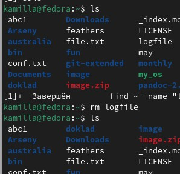{#fig:009 width=70%}

## Выполнение лабораторной работы

Запускаю в фоновом режиме редактор gedit (рис. 10).

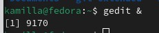{#fig:010 width=70%}

## Выполнение лабораторной работы

Определяю идентификатор процесса gedit с помощью ps. Далее с помощью pgrep (рис. 11).

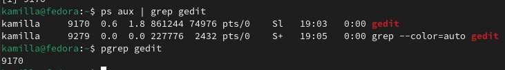{#fig:011 width=70%}

## Выполнение лабораторной работы

Читаю справку команды kill (рис. 12).

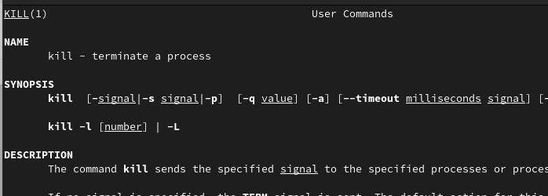{#fig:012 width=70%}

## Выполнение лабораторной работы

Использую kill для завершения процесса (рис. 13).

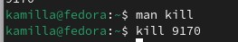{#fig:013 width=70%}

## Выполнение лабораторной работы

Читаю информацию о командах df и du (рис. 14]).

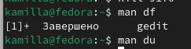{#fig:014 width=70%}

## Выполнение лабораторной работы

Использую команду du, чтобы узнать информацию о нодах (рис. 15).

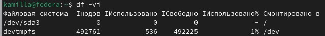{#fig:015 width=70%}

## Выполнение лабораторной работы

И далее использую df, чтобы узнать размер файлов (рис. 16).

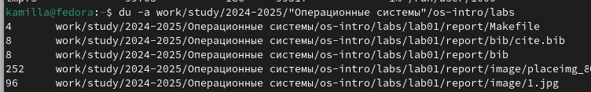{#fig:016 width=70%}

## Выполнение лабораторной работы

Читаю документацию о команде find (рис. 17).

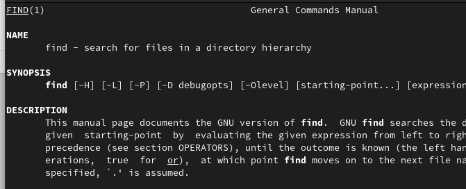{#fig:017 width=70%}

## Выполнение лабораторной работы

Вывожу имена всех директорий, имеющихся в домашнем каталоге (рис. 18).

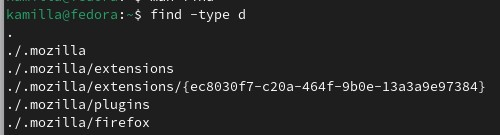{#fig:018 width=70%}

## Выводы

В ходе выполнения данной лабораторной работы я ознакомилась с инструментами поиска файлов и фильтрации текстовых данных.Приобрела практические навыки: по управлению процессами (и заданиями), по проверке использования диска и обслуживанию файловых систем.
