---
## Front matter
title: "Лабораторная работа №8"
subtitle: "Операционные системы"
author: "Краснова Камилла Геннадьевна"

## Generic otions
lang: ru-RU
toc-title: "Содержание"

## Bibliography
bibliography: bib/cite.bib
csl: pandoc/csl/gost-r-7-0-5-2008-numeric.csl

## Pdf output format
toc: true # Table of contents
toc-depth: 2
lof: true # List of figures
lot: true # List of tables
fontsize: 12pt
linestretch: 1.5
papersize: a4
documentclass: scrreprt
## I18n polyglossia
polyglossia-lang:
  name: russian
  options:
	- spelling=modern
	- babelshorthands=true
polyglossia-otherlangs:
  name: english
## I18n babel
babel-lang: russian
babel-otherlangs: english
## Fonts
mainfont: IBM Plex Serif
romanfont: IBM Plex Serif
sansfont: IBM Plex Sans
monofont: IBM Plex Mono
mathfont: STIX Two Math
mainfontoptions: Ligatures=Common,Ligatures=TeX,Scale=0.94
romanfontoptions: Ligatures=Common,Ligatures=TeX,Scale=0.94
sansfontoptions: Ligatures=Common,Ligatures=TeX,Scale=MatchLowercase,Scale=0.94
monofontoptions: Scale=MatchLowercase,Scale=0.94,FakeStretch=0.9
mathfontoptions:
## Biblatex
biblatex: true
biblio-style: "gost-numeric"
biblatexoptions:
  - parentracker=true
  - backend=biber
  - hyperref=auto
  - language=auto
  - autolang=other*
  - citestyle=gost-numeric
## Pandoc-crossref LaTeX customization
figureTitle: "Рис."
tableTitle: "Таблица"
listingTitle: "Листинг"
lofTitle: "Список иллюстраций"
lotTitle: "Список таблиц"
lolTitle: "Листинги"
## Misc options
indent: true
header-includes:
  - \usepackage{indentfirst}
  - \usepackage{float} # keep figures where there are in the text
  - \floatplacement{figure}{H} # keep figures where there are in the text
---

# Цель работы

Целью данной лабораторной работы является ознакомление с инструментами поиска файлов и фильтрации текстовых данных. Приобретение практических навыков: по управлению процессами (и заданиями), по проверке использования диска и обслуживанию файловых систем

# Задание

1. Осуществить вход в систему, используя соответствующее имя пользователя.
2. Записать в файл file.txt названия файлов, содержащихся в каталоге /etc. Дописать в этот же файл названия файлов, содержащихся в домашнем каталоге.
3. Вывести имена всех файлов из file.txt, имеющих расширение .conf, после чего запишите их в новый текстовой файл conf.txt.
4. Определить, какие файлы в домашнем каталоге имеют имена, начинавшиеся с символа c? Несколько вариантов, как это сделать.
5. ВывеСТИ на экран (по странично) имена файлов из каталога /etc, начинающиеся с символа h.
6. ЗапуститЬ в фоновом режиме процесс, который будет записывать в файл ~/logfile файлы, имена которых начинаются с log.
7. Удалить файл ~/logfile.
8. Запустить из консоли в фоновом режиме редактор gedit.
9. Определить идентификатор процесса gedit, используя команду ps, конвейер и фильтр grep.
10. Прочитать справку (man) команды kill, после чего использовать её для завершения процесса gedit.
11. Выполнить команды df и du, предварительно получив более подробную информацию об этих командах, с помощью команды man.
12. Воспользовавшись справкой команды find, вывести имена всех директорий, имеющихся в домашнем каталоге.

# Теоретическое введение

В системе по умолчанию открыто три специальных потока:
– stdin — стандартный поток ввода (по умолчанию: клавиатура), файловый дескриптор 0;
– stdout — стандартный поток вывода (по умолчанию: консоль), файловый дескриптор 1;
– stderr — стандартный поток вывод сообщений об ошибках (по умолчанию: консоль), файловый дескриптор 2.
Большинство используемых в консоли команд и программ записывают результаты своей работы в стандартный поток вывода stdout. Например, команда ls выводит в стандартный поток вывода (консоль) список файлов в текущей директории. Потоки вывода и ввода можно перенаправлять на другие файлы или устройства. Проще всего это делается с помощью символов >, >>, <, <<.

# Выполнение лабораторной работы

Захожу в систему под соответсвующим именем. Записываю в файл file.txt названия файлов, содержащихся в каталоге /etc (рис. [-@fig:001]).

{#fig:001 width=70%}

Далее дописываю в файл названия файлов, содержащихся в домашнем каталоге (рис. [-@fig:002]).

{#fig:002 width=70%}

Вывожу имена всех фалов из file.txt, имеющих расширение .conf (рис. [-@fig:003]).

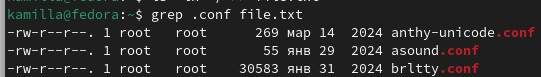{#fig:003 width=70%}

После чего записываю эти имена в новый текстовый файл conf.txt (рис. [-@fig:004]).

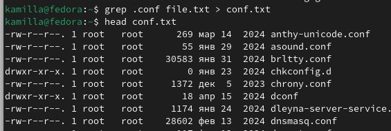{#fig:004 width=70%}

Сперва нахожу файлы в домашнем каталоге, которые начинаются с с, с помощью find (рис. [-@fig:005]).

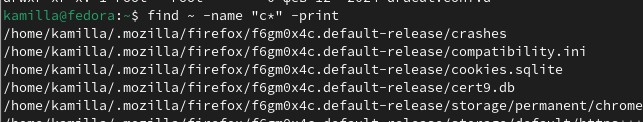{#fig:005 width=70%}

Далле произвожу поиск с помощью grep (рис. [-@fig:006]).

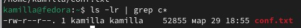{#fig:006 width=70%}

Вывожу на экран имена файлов, начинающихся с символа h (рис. [-@fig:007]).

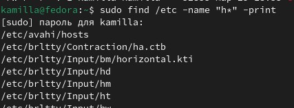{#fig:007 width=70%}

Запускаю в фоновом режиме процесс, который будет записывать в файл ~/logfile имена фалов, начинающихся с log (рис. [-@fig:008]).

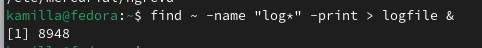{#fig:008 width=70%}

Удаляю logfile и убеждаюсь в этом с помощью ls (рис. [-@fig:009]).

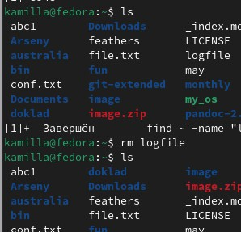{#fig:009 width=70%}

Запускаю в фоновом режиме редактор gedit (рис. [-@fig:010]).

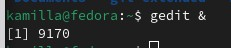{#fig:010 width=70%}

Определяю идентификатор процесса gedit с помощью ps. Далее с помощью pgrep (рис. [-@fig:011]).

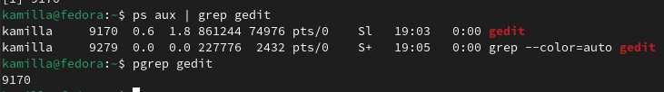{#fig:011 width=70%}

Читаю справку команды kill (рис. [-@fig:012]).

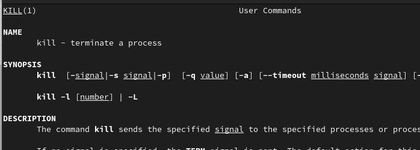{#fig:012 width=70%}

Использую kill для завершения процесса (рис. [-@fig:013]).

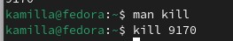{#fig:013 width=70%}

Читаю информацию о командах df и du (рис. [-@fig:014]).

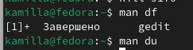{#fig:014 width=70%}

Использую команду du, чтобы узнать информацию о нодах (рис. [-@fig:015]).

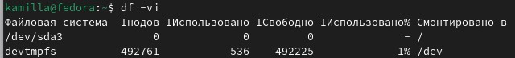{#fig:015 width=70%}

И далее использую df, чтобы узнать размер файлов (рис. [-@fig:016]).

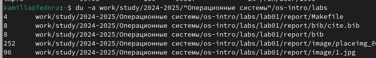{#fig:016 width=70%}

Читаю документацию о команде find (рис. [-@fig:017]).

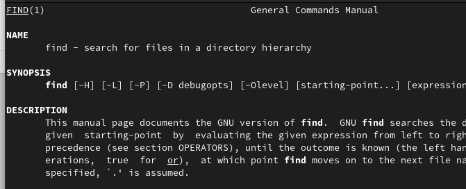{#fig:017 width=70%}

Вывожу имена всех директорий, имеющихся в домашнем каталоге (рис. [-@fig:018]).

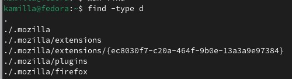{#fig:018 width=70%}

# Выводы

В ходе выполнения данной лабораторной работы я ознакомилась с инструментами поиска файлов и фильтрации текстовых данных.Приобрела практические навыки: по управлению процессами (и заданиями), по проверке использования диска и обслуживанию файловых систем.

# Контрольные вопросы

1. Какие потоки ввода вывода вы знаете? В системе по умолчанию открыто три специальных потока: – stdin — стандартный поток ввода (по умолчанию: клавиатура), файловый дескриптор 0; – stdout — стандартный поток вывода (по умолчанию: консоль), файловый дескриптор 1; – stderr — стандартный поток вывод сообщений об ошибках (по умолчанию: консоль), файловый дескриптор 2.

2. Объясните разницу между операцией > и ». Этот знак > - перенаправление ввода/вывода, а » - перенаправление в режиме добавления.

3. Что такое конвейер? Конвейер (pipe) служит для объединения простых команд или утилит в цепочки, в которых результат работы предыдущей команды передаётся последующей.

4. Что такое процесс? Чем это понятие отличается от программы? Главное отличие между программой и процессом заключается в том, что программа - это набор инструкций, который позволяет ЦПУ выполнять определенную задачу, в то время как процесс - это исполняемая программа.

5. Что такое PID и GID? PPID - (parent process ID) идентификатор родительского процесса. Процесс может порождать и другие процессы. UID, GID - реальные идентификаторы пользователя и его группы, запустившего данный процесс.

6. Что такое задачи и какая команда позволяет ими управлять? Запущенные фоном программы называются задачами (jobs). Ими можно управлять с помощью команды jobs, которая выводит список запущенных в данный момент задач.

7. Найдите информацию об утилитах top и htop. Каковы их функции?

Команда htop похожа на команду top по выполняемой функции: они обе показывают информацию о процессах в реальном времени, выводят данные о потреблении системных ресурсов и позволяют искать, останавливать и управлять процессами.

У обеих команд есть свои преимущества. Например, в программе htop реализован очень удобный поиск по процессам, а также их фильтрация. В команде top это не так удобно — нужно знать кнопку для вывода функции поиска.

Зато в top можно разделять область окна и выводить информацию о процессах в соответствии с разными настройками. В целом top намного более гибкая в настройке отображения процессов.

8. Назовите и дайте характеристику команде поиска файлов. Приведите примеры использования этой команды.

Команда find - это одна из наиболее важных и часто используемых утилит системы Linux. Это команда для поиска файлов и каталогов на основе специальных условий. Ее можно использовать в различных обстоятельствах, например, для поиска файлов по разрешениям, владельцам, группам, типу, размеру и другим подобным критериям.

Утилита find предустановлена по умолчанию во всех Linux дистрибутивах, поэтому вам не нужно будет устанавливать никаких дополнительных пакетов. Это очень важная находка для тех, кто хочет использовать командную строку наиболее эффективно.

Команда find имеет такой синтаксис: find [папка] [параметры] критерий шаблон [действие] Пример: find /etc -name "p*" -print

9. Можно ли по контексту (содержанию) найти файл? Если да, то как? find / -type f -exec grep -H 'текстДляПоиска' {} ;

10. Как определить объем свободной памяти на жёстком диске? С помощью команды df -h.

11. Как определить объем вашего домашнего каталога? С помощью команды du -s.

12. Как удалить зависший процесс? С помощью команды kill% номер задачи.

