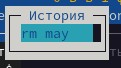

---
## Front matter
lang: ru-RU
title: Лабораторная работа №9
subtitle: Операционные системы
author:
  - Краснова К. Г.
institute:
  - Российский университет дружбы народов, Москва, Россия
date: 10 апрель 2025

## i18n babel
babel-lang: russian
babel-otherlangs: english

## Formatting pdf
toc: false
toc-title: Содержание
slide_level: 2
aspectratio: 169
section-titles: true
theme: metropolis
header-includes:
 - \metroset{progressbar=frametitle,sectionpage=progressbar,numbering=fraction}
---

## Цель работы

Целью данной дабораторной работы является освоение основных возможностей командной оболочки Midnight Commander. Приобретение навыков практической работы по просмотру каталогов и файлов; манипуляций с ними.

## Задание по mc

1. Изучите информацию о mc, вызвав в командной строке man mc.
2. Запустите из командной строки mc, изучите его структуру и меню.
3. Выполните несколько операций в mc, используя управляющие клавиши (операции с панелями; выделение/отмена выделения файлов, копирование/перемещение файлов, получение информации о размере и правах доступа на файлы и/или каталоги
и т.п.)
4. Выполните основные команды меню левой (или правой) панели. Оцените степень
подробности вывода информации о файлах.
5. Используя возможности подменю Файл , выполните:
  - просмотр содержимого текстового файла;
  - редактирование содержимого текстового файла (без сохранения результатов
  редактирования);
  - создание каталога;
  - копирование в файлов в созданный каталог.
6. С помощью соответствующих средств подменю Команда осуществите:
  - поиск в файловой системе файла с заданными условиями (например, файла
  с расширением .c или .cpp, содержащего строку main);
  - выбор и повторение одной из предыдущих команд;
  - переход в домашний каталог;
  - анализ файла меню и файла расширений.
7. Вызовите подменю Настройки . Освойте операции, определяющие структуру экрана mc
(Full screen, Double Width, Show Hidden Files и т.д.)

## Задание по встроенному редактору mc

1. Создайте текстовой файл text.txt.
2. Откройте этот файл с помощью встроенного в mc редактора.
3. Вставьте в открытый файл небольшой фрагмент текста, скопированный из любого
другого файла или Интернета.
4. Проделайте с текстом следующие манипуляции, используя горячие клавиши:
  - Удалите строку текста.
  - Выделите фрагмент текста и скопируйте его на новую строку
  - Выделите фрагмент текста и перенесите его на новую строку.
  - Сохраните файл.
  - Отмените последнее действие.
  - Перейдите в конец файла (нажав комбинацию клавиш) и напишите некоторый
  текст.
  - Перейдите в начало файла (нажав комбинацию клавиш) и напишите некоторый
  текст.
  4.8. Сохраните и закройте файл.
5. Откройте файл с исходным текстом на некотором языке программирования (напри-
мер C или Java)
6. Используя меню редактора, включите подсветку синтаксиса, если она не включена,
или выключите, если она включена

## Теоретическое введение

Командная оболочка — интерфейс взаимодействия пользователя с операционной систе-
мой и программным обеспечением посредством команд. Midnight Commander (или mc) — псевдографическая командная оболочка для UNIX/Linux систем. Для запуска mc необходимо в командной строке набрать mc и нажать Enter .
Рабочее пространство mc имеет две панели, отображающие по умолчанию списки файлов двух каталогов.
Панель в mc отображает список файлов текущего каталога. Абсолютный путь к этому каталогу отображается в заголовке панели. У активной панели заголовок и одна из её строк подсвечиваются. Управление панелями осуществляется с помощью определённых комбинаций клавиш или пунктов меню mc.
Панели можно поменять местами. Для этого и используется комбинация клавиш Ctrl-u или команда меню mc Переставить панели . Также можно временно убрать отображение панелей (отключить их) с помощью комбинации клавиш Ctrl-o или команды меню mc Отключить панели . Это может быть полезно, например, если необходимо увидеть вывод какой-то информации на экран после выполнения какой-либо команды shell

## Выполнение лабораторной работы

Изучаю информацию о mc (рис. 1).

{#fig:001 width=70%}

## Выполнение лабораторной работы

Запускаю из командной строки mc (рис. 2).

{#fig:002 width=70%}

## Выполнение лабораторной работы

С помощью F4 копирую файл (рис. 3).

{#fig:003 width=70%}

## Выполнение лабораторной работы

С помощью F8 удаляю файл (рис. 4).

{#fig:004 width=70%}

## Выполнение лабораторной работы

Выполняю основные команды правой панели. Информация о файлах подробнее, чем с вызовом ls (рис. 5).

{#fig:005 width=70%}

## Выполнение лабораторной работы

Используя возможности подменю Файл, просматриваю содержимое текстового файла (рис. 6).

{#fig:006 width=70%}

## Выполнение лабораторной работы

Редактирую файл, выхожу, но не сохраняю изменения (рис. 7).

{#fig:007 width=70%}

## Выполнение лабораторной работы

Создаю каталог (рис. 8).

{#fig:008 width=70%}

## Выполнение лабораторной работы

Копирую файл в созданный каталог (рис. 9).

{#fig:009 width=70%}

## Выполнение лабораторной работы

С помощью средств подменю Команда совершаю поиск файлов с расширением .txt (рис. 10).

{#fig:010 width=70%}

## Выполнение лабораторной работы

Перехожу в домашний каталог с помощью дерева каталогов (рис. 11).

{#fig:011 width=70%}

## Выполнение лабораторной работы

Повторение предыдущей команды (рис. 12).

{#fig:012 width=70%}

## Выполнение лабораторной работы

Анализ файла меню (рис. 13).

{#fig:013 width=70%}

## Выполнение лабораторной работы

Анализ файла расширений (рис. 14).

{#fig:014 width=70%}

## Выполнение лабораторной работы

Из подменю настройки вызвала окна настройки панели  (рис. 15).

{#fig:015 width=70%}

## Выполнение лабораторной работы

настройки внешнего вида  (рис. 16).

{#fig:016 width=70%}

## Выполнение лабораторной работы

настройки распознавания клавиш  (рис. 17).

{#fig:017 width=70%}

## Выполнение лабораторной работы

параметры конфигурации  (рис. 18).

{#fig:018 width=70%}

## Выполнение лабораторной работы

Командой touch text.txt создала файл (рис. 19).

{#fig:019 width=70%}

## Выполнение лабораторной работы

Клавишей F4 открыла файл для записи, добавила в него текст (рис. 20).

{#fig:020 width=70%}

## Выполнение лабораторной работы

Удалила строку текста с помощью ctrl+y  (рис. 21).

{#fig:021 width=70%}

## Выполнение лабораторной работы

Перемещаю выделенный текст с помощью клавиши F6 (рис. 22).

{#fig:022 width=70%}

## Выполнение лабораторной работы

Сохраняю изменения в файле с помощью горячей клавиши F2  (рис. 23).

{#fig:023 width=70%}

## Выполнение лабораторной работы

С помощью ctrl+u отменяю поседнее действие и возвращаю удаленную строку  (рис. 24).

{#fig:024 width=70%}

## Выполнение лабораторной работы

С помощью клавиш pgup pgdn у меня получилось попасть в начало и в конец файла соответственно, я добавила текст в начало и в конец файла  (рис. 25).

{#fig:025 width=70%}

## Выполнение лабораторной работы

Горячая клавиша F10 закрывает файл, дополнительно спрашивая сохранить ли в нем несохраненные изменения, сохраняю и закрываю (рис. 26).

{#fig:026 width=70%}

## Выполнение лабораторной работы

Открываю файл формата .cpp, с кодом на С++, встроенный редактор mc вывел его содержимое с подсветкой (рис. 27).

{#fig:027 width=70%}

Я отключила подсветку и вывела снова тот же самый файл, но уже без подсветки.

## Выводы

При выполнениии данной лабораторной работы я освоила основные возможности командной оболочки Midnight Commander, приобрела навыки практической работы по просмотру каталогов и файлов; манипуляций с ними

