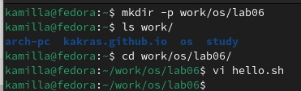
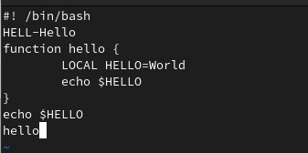
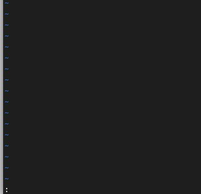
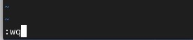
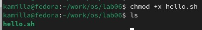
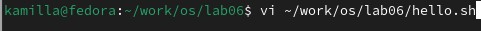
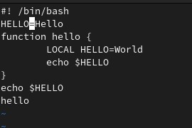
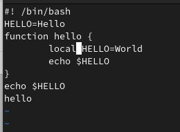
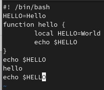
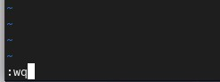

---
## Front matter
lang: ru-RU
title: Лабораторная работа №10
subtitle: Операционные системы
author:
  - Краснова К. Г.
institute:
  - Российский университет дружбы народов, Москва, Россия
date: 12 апреля 2025

## i18n babel
babel-lang: russian
babel-otherlangs: english

## Formatting pdf
toc: false
toc-title: Содержание
slide_level: 2
aspectratio: 169
section-titles: true
theme: metropolis
header-includes:
 - \metroset{progressbar=frametitle,sectionpage=progressbar,numbering=fraction}
---

## Цель работы

Цель данной лабораторной работы - познакомиться с операционной системой Linux. Получить практические навыки рабо-
ты с редактором vi, установленным по умолчанию практически во всех дистрибутивах.

## Задание

Здесь приводится описание задания в соответствии с рекомендациями
методического пособия и выданным вариантом.

## Теоретическое введение

В большинстве дистрибутивов Linux в качестве текстового редактора по умолчанию устанавливается интерактивный экранный редактор vi (Visual display editor). Редактор vi имеет три режима работы:
– командный режим — предназначен для ввода команд редактирования и навигации поредактируемому файлу;
– режим вставки — предназначен для ввода содержания редактируемого файла;
– режим последней (или командной) строки — используется для записи изменений в файл и выхода из редактора.
Для вызова редактора vi необходимо указать команду vi и имя редактируемого файла: vi <имя_файла>
При этом в случае отсутствия файла с указанным именем будет создан такой файл.
Переход в командный режим осуществляется нажатием клавиши Esc . Для выхода из редактора vi необходимо перейти в режим последней строки: находясь в командном режиме, нажать Shift-; (по сути символ : — двоеточие), затем:
– набрать символы wq, если перед выходом из редактора требуется записать изменения в файл;
– набрать символ q (или q!), если требуется выйти из редактора без сохранения.

## Выполнение лабораторной работы

Создаю каталог с именем ~/work/os/lab06. Перехожу в созданный каталог, вызываю vi и создаю файл helli.sh (рис. 1).

{#fig:001 width=70%}

## Выполнение лабораторной работы

Нажимаю i и ввожу текст. Нажимаю клавишу Esc для перехода в командный режим (рис. 2).

{#fig:002 width=70%}

## Выполнение лабораторной работы

Нажимаю : для перехода в режим последней строки (рис. 3).

{#fig:003 width=70%}

## Выполнение лабораторной работы

Записываю и выхожу из файла с сохранением текста (рис. 4).

{#fig:004 width=70%}

## Выполнение лабораторной работы

Делаю файл исполняемым (рис. 5).

{#fig:005 width=70%}

## Выполнение лабораторной работы

Вызываю vi на редактирование файла (рис. 6).

{#fig:006 width=70%}

## Выполнение лабораторной работы

Устанавливаю курсор в конец слова второй строки и заменяю на HELLO (рис. 7).

{#fig:007 width=70%}

## Выполнение лабораторной работы

Устанавливаю курсор на четвертую строку и стираю слово LOCAL вместо этого прописываю local (рис. 8).

{#fig:008 width=70%}

## Выполнение лабораторной работы

Устанавливаю курсор на последней строке файла. Вставляю после нее строчку, перехожу в командный режим, удаляю последнюю строку и выполняю команду отмены изменений (рис. 9).

{#fig:009 width=70%}

## Выполнение лабораторной работы

Ввожу символ : для перехода в режим последней строки, записываю изменения и выхожу из vi (рис. 10).

{#fig:010 width=70%}

## Выводы

В ходе выполнения данной лабораторной работы я познакомилась с операционной системой Linux. Получила практические навыки работы с редактором vi, установленным по умолчанию практически во всех дистрибутивах.

