---
## Front matter
lang: ru-RU
title: Лабораторная работа №11
subtitle: Операционные системы
author:
  - Краснова К. Г.
institute:
  - Российский университет дружбы народов, Москва, Россия
date: 25 апреля 2025

## i18n babel
babel-lang: russian
babel-otherlangs: english

## Formatting pdf
toc: false
toc-title: Содержание
slide_level: 2
aspectratio: 169
section-titles: true
theme: metropolis
header-includes:
 - \metroset{progressbar=frametitle,sectionpage=progressbar,numbering=fraction}
---

## Цель работы

Цель данной лабораторной работы: Познакомиться с операционной системой Linux. Получить практические навыки рабо-
ты с редактором Emacs. 

## Задание

1. Ознакомиться с теоретическим материалом.
2. Ознакомиться с редактором emacs.
3. Выполнить упражнения.
4. Ответить на контрольные вопросы.

## Теоретическое введение

Определение 1. Буфер — объект, представляющий какой-либо текст.
Буфер может содержать что угодно, например, результаты компиляции программы или встроенные подсказки. Практически всё взаимодействие с пользователем, в том числе интерактивное, происходит посредством буферов.
Определение 2. Фрейм соответствует окну в обычном понимании этого слова. Каждый фрейм содержит область вывода и одно или несколько окон Emacs.
Определение 3. Окно — прямоугольная область фрейма, отображающая один из буферов.
Каждое окно имеет свою строку состояния, в которой выводится следующая информация: название буфера, его основной режим, изменялся ли текст буфера и как далеко вниз по буферу расположен курсор. Каждый буфер находится только в одном из возможных основных режимов. Существующие основные режимы включают режим Fundamental (наименее специализированный), режим Text, режим Lisp, режим С, режим Texinfo и другие. Под второстепенными режимами понимается список режимов, которые включены в данный момент в буфере выбранного окна.

## Выполнение лабораторной работы

Открываю emacs (рис. 1).

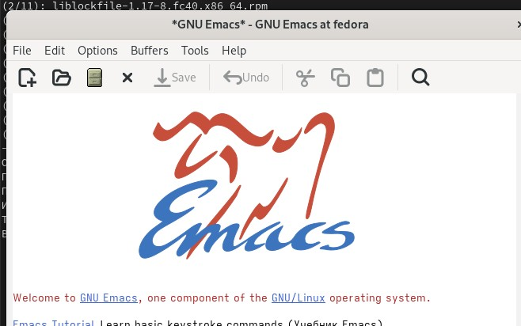{#fig:001 width=70%}

## Выполнение лабораторной работы

Создаю файл lab07.sh (рис. 2).

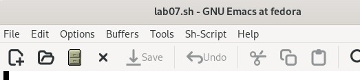{#fig:002 width=70%}

## Выполнение лабораторной работы

Набираю текст (рис. 3).

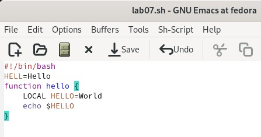{#fig:003 width=70%}

## Выполнение лабораторной работы

Сохраняю файл с помощью комбинации клавиш (рис. 4).

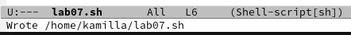{#fig:004 width=70%}

## Выполнение лабораторной работы

Вырезаю одной командой целую строку (рис. 5).

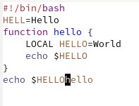{#fig:005 width=70%}

## Выполнение лабораторной работы

Вставляю эту строку в конец файла (рис. 6).

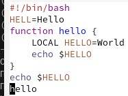{#fig:006 width=70%}

## Выполнение лабораторной работы

Выделяю область текста, копирую в буфер обмена и вставляю в конец (рис. 7).

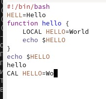{#fig:007 width=70%}

## Выполнение лабораторной работы

Выделяю область и вырезаю ее (рис. 8).

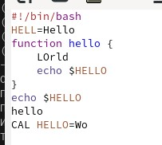{#fig:008 width=70%}

## Выполнение лабораторной работы

Отменяю последнее действие (рис. 9).

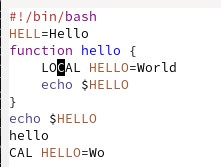{#fig:009 width=70%}

## Выполнение лабораторной работы

Перемещаю курсор в начало строки (рис. 10).

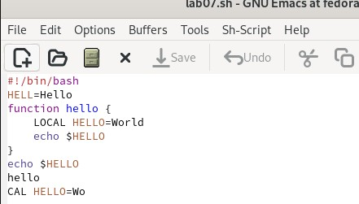{#fig:010 width=70%}

## Выполнение лабораторной работы

Перемещаю курсор в конец строки (рис. 11).

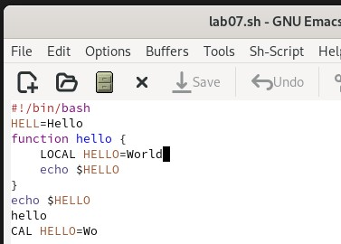{#fig:011 width=70%}

## Выполнение лабораторной работы

Перемещаю курсор в начало буфера (рис. 12).

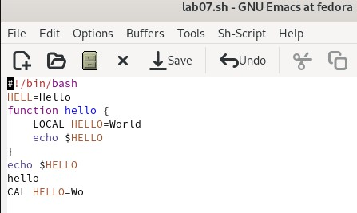{#fig:012 width=70%}

## Выполнение лабораторной работы

Перемещаю курсор в конец буфера (рис. 13).

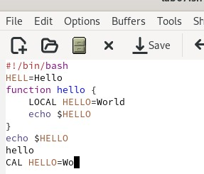{#fig:013 width=70%}

## Выполнение лабораторной работы

Вывожу список активных буферов на экран (рис. 14).

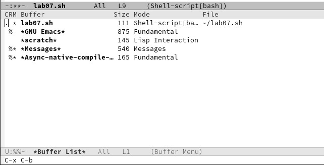{#fig:014 width=70%}

## Выполнение лабораторной работы

Перемещаюсь во вновь открытое окно (C-x) o со списком открытых буферов и переключаюсь на другой буфер (рис. 15).

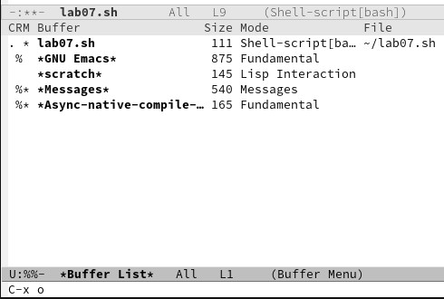{#fig:015 width=70%}

## Выполнение лабораторной работы

Закрываю окно (рис. 16).

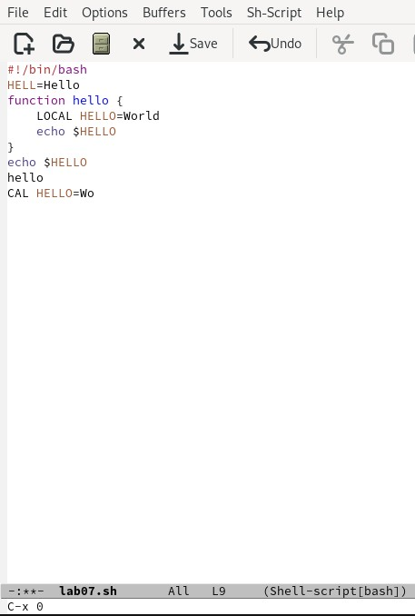{#fig:016 width=70%}

## Выполнение лабораторной работы

Теперь вновь переключайтесь между буферами, но уже без вывода их списка на экран (рис. 17).

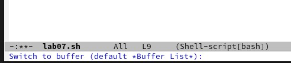{#fig:017 width=70%}

## Выполнение лабораторной работы

Делю фрейм на 4 части: разделяю фрейм на два окна по вертикали (C-x 3), а затем каждое из этих окон на две части по горизонтали (C-x 2) (рис. 18).

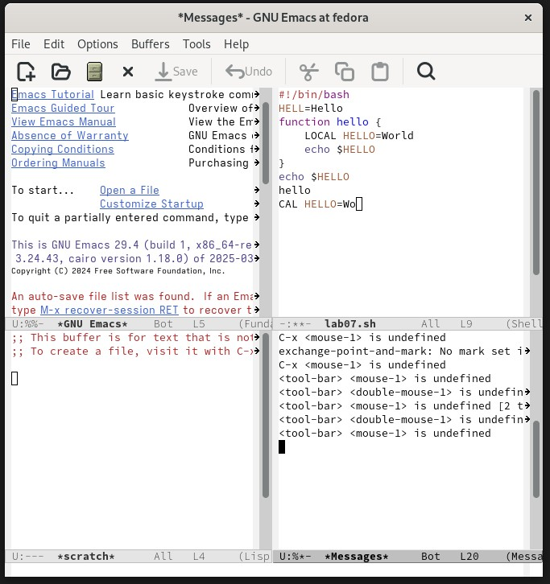{#fig:018 width=70%}

## Выполнение лабораторной работы

В каждом из четырёх созданных окон откройте новый буфер (файл) и введите несколько строк текста (рис. 19).

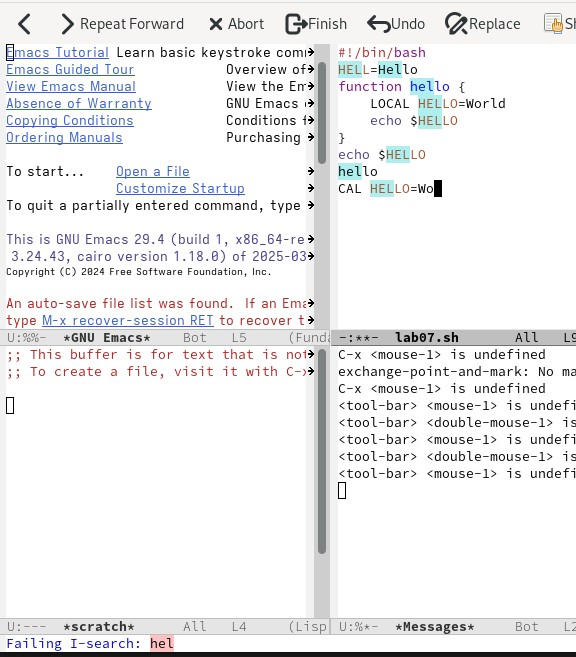{#fig:019 width=70%}

## Выполнение лабораторной работы

Переключаюсь в режим поиска (C-s) и нахожу несколько слов, присутствующих в тексте (рис. 20).

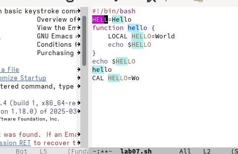{#fig:020 width=70%}

## Выполнение лабораторной работы

Переключаюсь между результатами поиска, нажимая C-s (рис. 21).

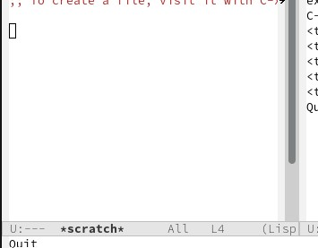{#fig:021 width=70%}

## Выполнение лабораторной работы

Пробую другой режим поиска (рис. 22).

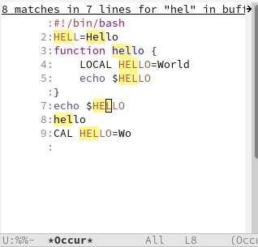{#fig:022 width=70%}

## Выводы

В ходе выполнения данной лабораторной работы я познакомилась с операционной системой Linux. Получила практические навыки работы с редактором Emacs. 
