---
## Front matter
title: "Лабораторная работа №11"
subtitle: "Операционные системы"
author: "Краснова Камилла Геннадьевна"

## Generic otions
lang: ru-RU
toc-title: "Содержание"

## Bibliography
bibliography: bib/cite.bib
csl: pandoc/csl/gost-r-7-0-5-2008-numeric.csl

## Pdf output format
toc: true # Table of contents
toc-depth: 2
lof: true # List of figures
lot: true # List of tables
fontsize: 12pt
linestretch: 1.5
papersize: a4
documentclass: scrreprt
## I18n polyglossia
polyglossia-lang:
  name: russian
  options:
	- spelling=modern
	- babelshorthands=true
polyglossia-otherlangs:
  name: english
## I18n babel
babel-lang: russian
babel-otherlangs: english
## Fonts
mainfont: IBM Plex Serif
romanfont: IBM Plex Serif
sansfont: IBM Plex Sans
monofont: IBM Plex Mono
mathfont: STIX Two Math
mainfontoptions: Ligatures=Common,Ligatures=TeX,Scale=0.94
romanfontoptions: Ligatures=Common,Ligatures=TeX,Scale=0.94
sansfontoptions: Ligatures=Common,Ligatures=TeX,Scale=MatchLowercase,Scale=0.94
monofontoptions: Scale=MatchLowercase,Scale=0.94,FakeStretch=0.9
mathfontoptions:
## Biblatex
biblatex: true
biblio-style: "gost-numeric"
biblatexoptions:
  - parentracker=true
  - backend=biber
  - hyperref=auto
  - language=auto
  - autolang=other*
  - citestyle=gost-numeric
## Pandoc-crossref LaTeX customization
figureTitle: "Рис."
tableTitle: "Таблица"
listingTitle: "Листинг"
lofTitle: "Список иллюстраций"
lotTitle: "Список таблиц"
lolTitle: "Листинги"
## Misc options
indent: true
header-includes:
  - \usepackage{indentfirst}
  - \usepackage{float} # keep figures where there are in the text
  - \floatplacement{figure}{H} # keep figures where there are in the text
---

# Цель работы

Цель данной лабораторной работы: Познакомиться с операционной системой Linux. Получить практические навыки рабо-
ты с редактором Emacs. 

# Задание

1. Ознакомиться с теоретическим материалом.
2. Ознакомиться с редактором emacs.
3. Выполнить упражнения.
4. Ответить на контрольные вопросы.

# Теоретическое введение

Определение 1. Буфер — объект, представляющий какой-либо текст.
Буфер может содержать что угодно, например, результаты компиляции программы или встроенные подсказки. Практически всё взаимодействие с пользователем, в том числе интерактивное, происходит посредством буферов.
Определение 2. Фрейм соответствует окну в обычном понимании этого слова. Каждый фрейм содержит область вывода и одно или несколько окон Emacs.
Определение 3. Окно — прямоугольная область фрейма, отображающая один из буферов.
Каждое окно имеет свою строку состояния, в которой выводится следующая информация: название буфера, его основной режим, изменялся ли текст буфера и как далеко вниз по буферу расположен курсор. Каждый буфер находится только в одном из возможных основных режимов. Существующие основные режимы включают режим Fundamental (наименее специализированный), режим Text, режим Lisp, режим С, режим Texinfo и другие. Под второстепенными режимами понимается список режимов, которые включены в данный момент в буфере выбранного окна.

# Выполнение лабораторной работы

Открываю emacs (рис. [-@fig:001]).

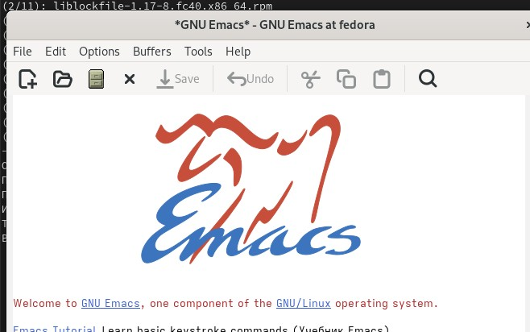{#fig:001 width=70%}

Создаю файл lab07.sh (рис. [-@fig:002]).

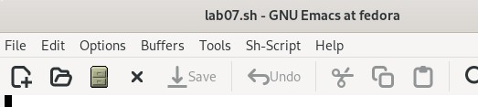{#fig:002 width=70%}

Набираю текст (рис. [-@fig:003]).

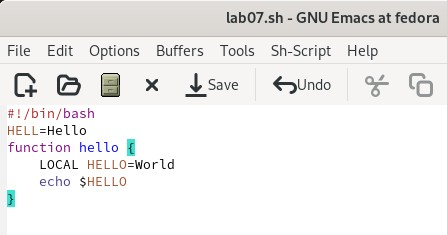{#fig:003 width=70%}

Сохраняю файл с помощью комбинации клавиш (рис. [-@fig:004]).

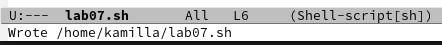{#fig:004 width=70%}

Вырезаю одной командой целую строку (рис. [-@fig:005]).

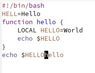{#fig:005 width=70%}

Вставляю эту строку в конец файла (рис. [-@fig:006]).

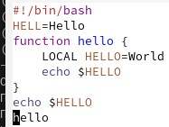{#fig:006 width=70%}

Выделяю область текста, копирую в буфер обмена и вставляю в конец (рис. [-@fig:007]).

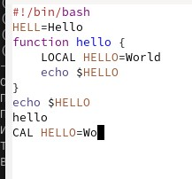{#fig:007 width=70%}

Выделяю область и вырезаю ее (рис. [-@fig:008]).

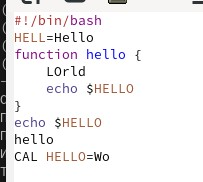{#fig:008 width=70%}

Отменяю последнее действие (рис. [-@fig:009]).

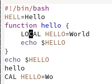{#fig:009 width=70%}

Перемещаю курсор в начало строки (рис. [-@fig:010]).

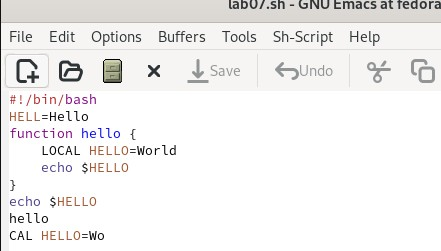{#fig:010 width=70%}

Перемещаю курсор в конец строки (рис. [-@fig:011]).

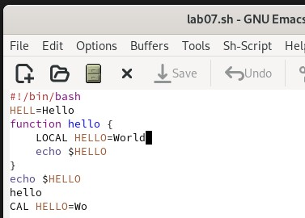{#fig:011 width=70%}

Перемещаю курсор в начало буфера (рис. [-@fig:012]).

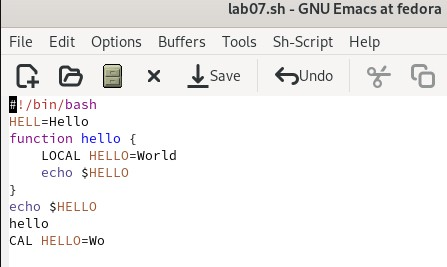{#fig:012 width=70%}

Перемещаю курсор в конец буфера (рис. [-@fig:013]).

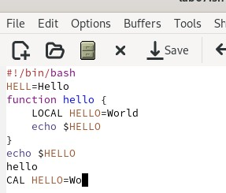{#fig:013 width=70%}

Вывожу список активных буферов на экран (рис. [-@fig:014]).

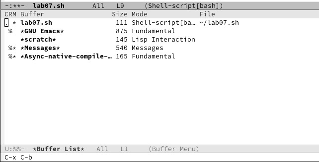{#fig:014 width=70%}

Перемещаюсь во вновь открытое окно (C-x) o со списком открытых буферов и переключаюсь на другой буфер (рис. [-@fig:015]).

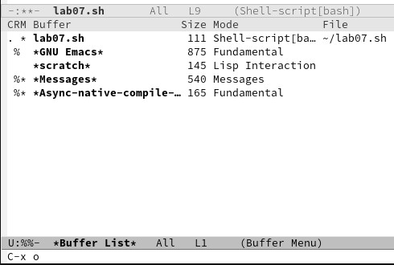{#fig:015 width=70%}

Закрываю окно (рис. [-@fig:016]).

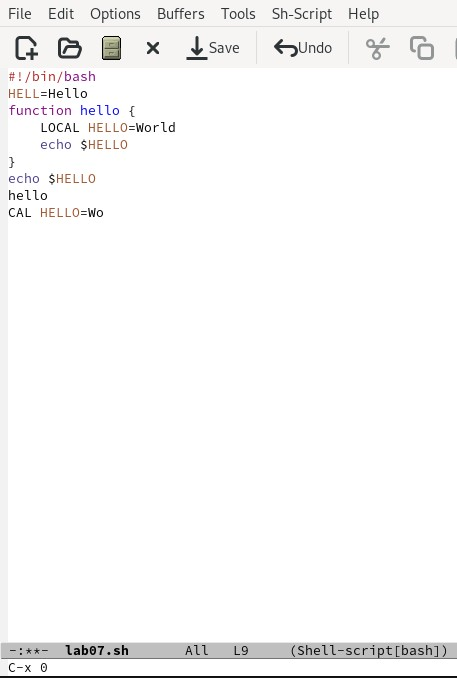{#fig:016 width=70%}

Теперь вновь переключайтесь между буферами, но уже без вывода их списка на экран (рис. [-@fig:017]).

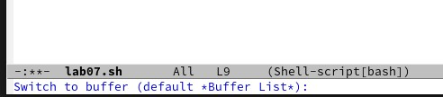{#fig:017 width=70%}

Делю фрейм на 4 части: разделяю фрейм на два окна по вертикали (C-x 3), а затем каждое из этих окон на две части по горизонтали (C-x 2) (рис. [-@fig:018]).

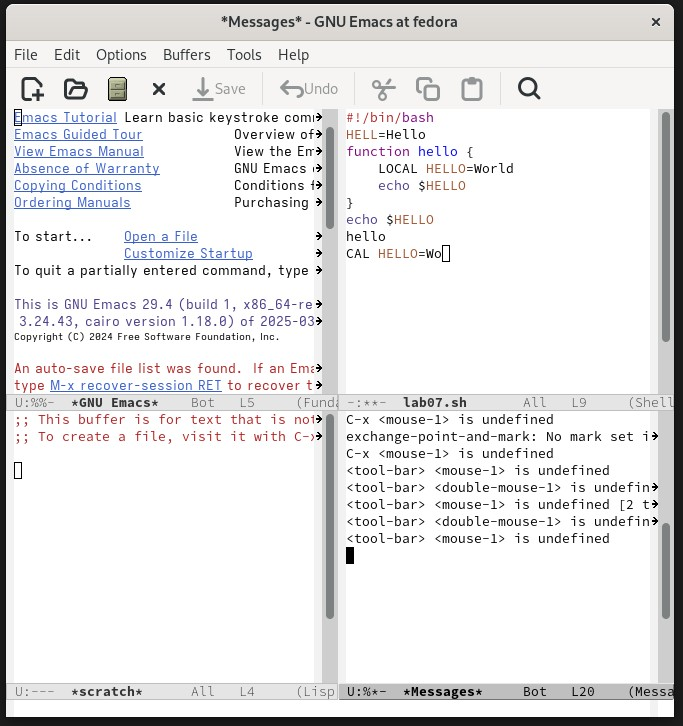{#fig:018 width=70%}

В каждом из четырёх созданных окон откройте новый буфер (файл) и введите несколько строк текста (рис. [-@fig:019]).

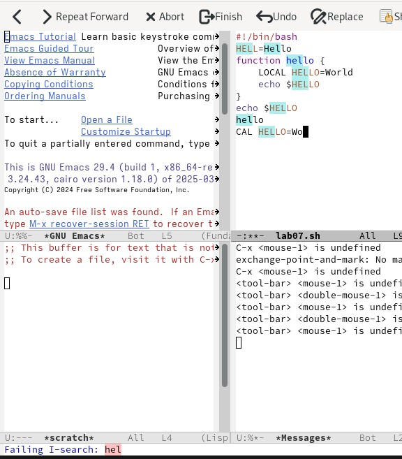{#fig:019 width=70%}

Переключаюсь в режим поиска (C-s) и нахожу несколько слов, присутствующих в тексте (рис. [-@fig:020]).

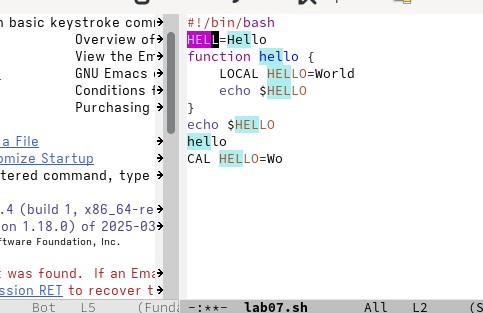{#fig:020 width=70%}

Переключаюсь между результатами поиска, нажимая C-s (рис. [-@fig:021]).

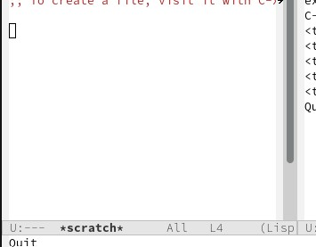{#fig:021 width=70%}

Пробую другой режим поиска (рис. [-@fig:022]).

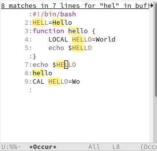{#fig:022 width=70%}

# Выводы

В ходе выполнения данной лабораторной работы я познакомилась с операционной системой Linux. Получила практические навыки работы с редактором Emacs. 

# Ответы на контрольные вопросы

1. Кратко охарактеризуйте редактор emacs.

Emacs — один из наиболее мощных и широко распространённых редакторов, используемых в мире UNIX. Написан на языке высокого уровня Lisp.

2. Какие особенности данного редактора могут сделать его сложным для освоения новичком?

Большое разнообразие сложных комбинаций клавиш, которые необходимы для редактирования файла и в принципе для работа с Emacs.

3. Своими словами опишите, что такое буфер и окно в терминологии emacs’а.

Буфер - это объект в виде текста. Окно - это прямоугольная область, в которой отображен буфер.

4. Можно ли открыть больше 10 буферов в одном окне?

Да, можно.

5. Какие буферы создаются по умолчанию при запуске emacs?

Emacs использует буферы с именами, начинающимися с пробела, для внутренних целей. Отчасти он обращается с буферами с такими именами особенным образом — например, по умолчанию в них не записывается информация для отмены изменений.

6. Какие клавиши вы нажмёте, чтобы ввести следующую комбинацию C-c | и C-c C-|?

Ctrl + c, а потом | и Ctrl + c Ctrl + |

7. Как поделить текущее окно на две части?

С помощью команды Ctrl + x 3 (по вертикали) и Ctrl + x 2 (по горизонтали).

8. В каком файле хранятся настройки редактора emacs?

Настройки emacs хранятся в файле . emacs, который хранится в домашней дирректории пользователя. Кроме этого файла есть ещё папка . emacs.

9. Какую функцию выполняет клавиша и можно ли её переназначить?

Выполняет функцию стереть, думаю можно переназначить.

10. Какой редактор вам показался удобнее в работе vi или emacs? Поясните почему.

Для меня удобнее был редактор Emacs, так как у него есть командая оболочка. А vi открывается в терминале, и выглядит своеобразно.
# Список литературы{.unnumbered}

::: {#refs}
:::
