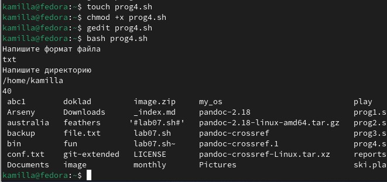

---
## Front matter
lang: ru-RU
title: Лабораторная работа №12
subtitle: Операционные системы
author:
  - Краснова К. Г.
institute:
  - Российский университет дружбы народов, Москва, Россия
date: 02 мая 2025

## i18n babel
babel-lang: russian
babel-otherlangs: english

## Formatting pdf
toc: false
toc-title: Содержание
slide_level: 2
aspectratio: 169
section-titles: true
theme: metropolis
header-includes:
 - \metroset{progressbar=frametitle,sectionpage=progressbar,numbering=fraction}
---

## Цель работы

Цель данной лабораторной работы: изучить основы программирования в оболочке ОС UNIX/Linux. Научиться писать небольшие командные файлы.

## Задание

1. Написать скрипт, который при запуске будет делать резервную копию самого себя (то есть файла, в котором содержится его исходный код) в другую директорию backup в вашем домашнем каталоге. При этом файл должен архивироваться одним из архиваторов на выбор zip, bzip2 или tar. Способ использования команд архивации необходимо узнать, изучив справку.
2. Написать пример командного файла, обрабатывающего любое произвольное число аргументов командной строки, в том числе превышающее десять. Например, скрипт может последовательно распечатывать значения всех переданных аргументов.
3. Написать командный файл — аналог команды ls (без использования самой этой команды и команды dir). Требуется, чтобы он выдавал информацию о нужном каталоге и выводил информацию о возможностях доступа к файлам этого каталога.
4. Написать командный файл, который получает в качестве аргумента командной строки формат файла (.txt, .doc, .jpg, .pdf и т.д.) и вычисляет количество таких файлов в указанной директории. Путь к директории также передаётся в виде аргумента командной строки

## Теоретическое введение

Командный процессор (командная оболочка, интерпретатор команд shell) — это программа, позволяющая пользователю взаимодействовать с операционной системой компьютера. В операционных системах типа UNIX/Linux наиболее часто используются следующие реализации командных оболочек:
– оболочка Борна (Bourne shell или sh) — стандартная командная оболочка UNIX/Linux, содержащая базовый, но при этом полный набор функций;
– С-оболочка (или csh) — надстройка на оболочкой Борна, использующая С-подобный синтаксис команд с возможностью сохранения истории выполнения команд;
– оболочка Корна (или ksh) — напоминает оболочку С, но операторы управления программой совместимы с операторами оболочки Борна;
– BASH — сокращение от Bourne Again Shell (опять оболочка Борна), в основе своей совмещает свойства оболочек С и Корна (разработка компании Free Software Foundation).
POSIX (Portable Operating System Interface for Computer Environments) — набор стандартов описания интерфейсов взаимодействия операционной системы и прикладных программ.

## Выполнение лабораторной работы

Создаю файл prog1.sh в котором буду писать программу, а также необходимую нам папку. Запускаю программу (рис. 1).

{#fig:001 width=70%}

## Выполнение лабораторной работы

Код программы, которая делает резервную копию файла (рис. 2).

{#fig:002 width=70%}

## Выполнение лабораторной работы

Создаю файл prog2.sh, в котором будет записана программа, обрабатывающая любое произвольное число (рис. 3).

{#fig:003 width=70%}

## Выполнение лабораторной работы

Пример программы (рис. 4).

{#fig:004 width=70%}

## Выполнение лабораторной работы

Далее создаю файл prog3.sh, добавляю в него права и записываю код, далее запускаю его (рис. 5).

{#fig:005 width=70%}

## Выполнение лабораторной работы

Пример кода -  аналога ls (рис. 6).

{#fig:006 width=70%}

## Выполнение лабораторной работы

Так же создаю файл prog4.sh, принимающий в качестве аргумента формат файла (рис. 7).

{#fig:007 width=70%}

## Выполнение лабораторной работы

Код программы, считывающей формат файла (рис. 8).

{#fig:008 width=70%}

## Выводы

В ходе выполнения данной лабораторной работы я изучила основы программирования в оболочке ОС UNIX/Linux. Научилась писать небольшие командные файлы.
