---
## Front matter
lang: ru-RU
title: Лабораторная работа №13
subtitle: Операционные системы
author:
  - Краснова  К. Г.
institute:
  - Российский университет дружбы народов, Москва, Россия
date: 10 мая 2025

## i18n babel
babel-lang: russian
babel-otherlangs: english

## Formatting pdf
toc: false
toc-title: Содержание
slide_level: 2
aspectratio: 169
section-titles: true
theme: metropolis
header-includes:
 - \metroset{progressbar=frametitle,sectionpage=progressbar,numbering=fraction}
---

## Цель работы

Цель работы - Изучить основы программирования в оболочке ОС UNIX. Научится писать более
сложные командные файлы с использованием логических управляющих конструкций
и циклов.

## Задание

1. Используя команды getopts grep, написать командный файл, который анализирует
командную строку с ключами:
– -iinputfile — прочитать данные из указанного файла;
– -ooutputfile — вывести данные в указанный файл;
– -pшаблон — указать шаблон для поиска;
– -C — различать большие и малые буквы;
– -n — выдавать номера строк.
а затем ищет в указанном файле нужные строки, определяемые ключом -p.
2. Написать на языке Си программу, которая вводит число и определяет, является ли оно
больше нуля, меньше нуля или равно нулю. Затем программа завершается с помощью
функции exit(n), передавая информацию в о коде завершения в оболочку. Команд-
ный файл должен вызывать эту программу и, проанализировав с помощью команды
$?, выдать сообщение о том, какое число было введено.
3. Написать командный файл, создающий указанное число файлов, пронумерованных
последовательно от 1 до 𝑁 (например 1.tmp, 2.tmp, 3.tmp,4.tmp и т.д.). Число файлов,
которые необходимо создать, передаётся в аргументы командной строки. Этот же ко-
мандный файл должен уметь удалять все созданные им файлы (если они существуют).
4. Написать командный файл, который с помощью команды tar запаковывает в архив
все файлы в указанной директории. Модифицировать его так, чтобы запаковывались
только те файлы, которые были изменены менее недели тому назад (использовать
команду find).

## Выполнение лабораторной работы

Создаю файл, который будет анализировать командную строку с ключами (рис. 1).

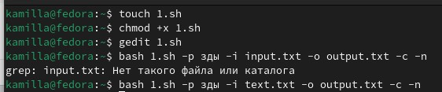{#fig:001 width=70%}

## Выполнение лабораторной работы

Пример кода, который будет анализировать командную строку (рис. 2).

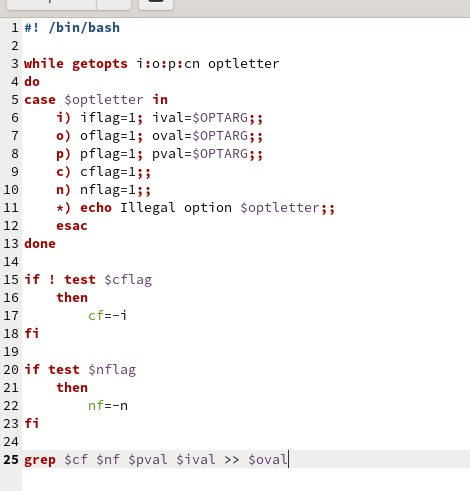{#fig:002 width=70%}

## Выполнение лабораторной работы

Результат выполнения команды (рис. 3).

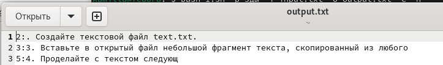{#fig:003 width=70%}

## Выполнение лабораторной работы

Создаю файл для программы на языке С, которая будет определять, является ли число больше нуля (рис. 4).

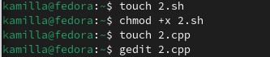{#fig:004 width=70%}

## Выполнение лабораторной работы

Пример кода для этого пункта  на Си (рис. 5).

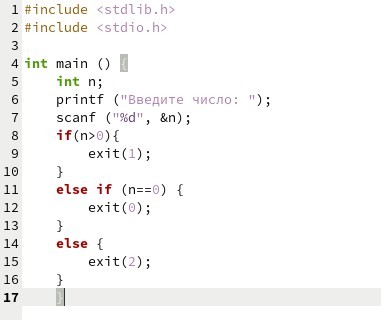{#fig:005 width=70%}

## Выполнение лабораторной работы

Код, анализирующий (рис. 6).

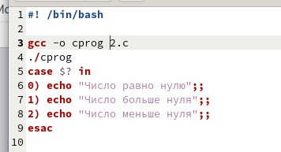{#fig:006 width=70%}

## Выполнение лабораторной работы

Результат выполнения программы (рис. 7).

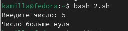{#fig:007 width=70%}

## Выполнение лабораторной работы

Создаю файл для третьего пункта, пишу программу, которая будет создавать и удалять файлы (рис. 8).

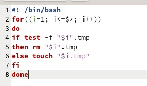{#fig:008 width=70%}

## Выполнение лабораторной работы

Результат выполнения (рис. 9).

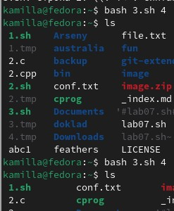{#fig:009 width=70%}

## Выполнение лабораторной работы

Создаю файл для последней программы и вписываю в него код (рис. 10).

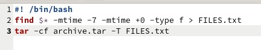{#fig:010 width=70%}

## Выполнение лабораторной работы

Результат программы - архив файлов (рис. 11).

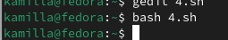{#fig:011 width=70%}

## Выводы

В ходе выполнения данной лабораторной работы я: Изучить основы программирования в оболочке ОС UNIX. Научится писать более
сложные командные файлы с использованием логических управляющих конструкций
и циклов.

