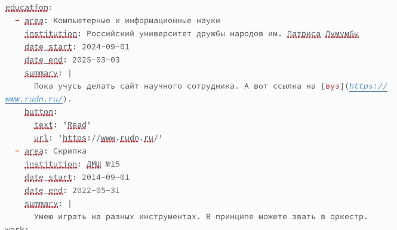

---
## Front matter
lang: ru-RU
title: Второй этап индивидуального проекта
subtitle: Операционные системы
author:
  - Краснова К. Г.
institute:
  - Российский университет дружбы народов, Москва, Россия
date: 21 марта 2025

## i18n babel
babel-lang: russian
babel-otherlangs: english

## Formatting pdf
toc: false
toc-title: Содержание
slide_level: 2
aspectratio: 169
section-titles: true
theme: metropolis
header-includes:
 - \metroset{progressbar=frametitle,sectionpage=progressbar,numbering=fraction}
---

## Цель работы

Целью данной лабораторной работы является добавление основных данных о себе и создание постов.

## Задание

1. Разместить фотографию владельца сайта.
2. Разместить краткое описание владельца сайта (Biography).
3. Добавить информацию об интересах (Interests).
4. Добавить информацию от образовании (Education).
5. Сделать пост по прошедшей неделе.
6. Добавить пост на тему: Управление версиями. Git.

## Размещение фотографии владельца

Добавляю в папку admin свою фотографию, которая будет в дальнейшем отображаться на сайте (рис. 1).

{#fig:001 width=70%}

## Размещение информации о владельце сайта

Прописываю свое имя (рис. 2).

{#fig:002 width=70%}

## Размещение информации о владельце сайта

Пишу кем я являюсь на данный момент и добавляю ссылку на ВУЗ (рис. 3).

{#fig:003 width=70%}

## Информация об интересах

Добавляю информацию о своих интересах (рис. 4).

{#fig:004 width=70%}

## Образование

Прописываю где я обучалась и обучаюсь, вставляю ссылку на место обучения (рис. 5).

{#fig:005 width=70%}

## Обо мне

В конце добавляю краткую информацию о себе (рис. 6).

{#fig:006 width=70%}

## Обо мне

В итоге как выглядит теперь моя страничка (рис. 7).

{#fig:007 width=70%}

## Пост о прошедшей неделе

Захожу в папку post. Начинаю писать пост о прошедшей неделе (рис. 8).

{#fig:008 width=70%}

## Пост о прошедшей неделе

Смотрю, как это выглядит на сайте (рис. 9).

{#fig:009 width=70%}

## Пост об управлении версиями git

Начинаю прописывать пост (рис. 10).

{#fig:010 width=70%}

## Пост об управлении версиями git

Уже готовый написанный пост на сайте (рис. 11).

{#fig:011 width=70%}

## Выводы

В ходе выполнения данной лабораторной работы я научилась добавлять основные данные о себе и создавать посты.

