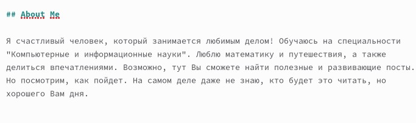

---
## Front matter
title: "Второй этап индивидуального проекта"
subtitle: "Операционные системы"
author: "Краснова Камилла Геннадьевна"

## Generic otions
lang: ru-RU
toc-title: "Содержание"

## Bibliography
bibliography: bib/cite.bib
csl: pandoc/csl/gost-r-7-0-5-2008-numeric.csl

## Pdf output format
toc: true # Table of contents
toc-depth: 2
lof: true # List of figures
lot: true # List of tables
fontsize: 12pt
linestretch: 1.5
papersize: a4
documentclass: scrreprt
## I18n polyglossia
polyglossia-lang:
  name: russian
  options:
	- spelling=modern
	- babelshorthands=true
polyglossia-otherlangs:
  name: english
## I18n babel
babel-lang: russian
babel-otherlangs: english
## Fonts
mainfont: IBM Plex Serif
romanfont: IBM Plex Serif
sansfont: IBM Plex Sans
monofont: IBM Plex Mono
mathfont: STIX Two Math
mainfontoptions: Ligatures=Common,Ligatures=TeX,Scale=0.94
romanfontoptions: Ligatures=Common,Ligatures=TeX,Scale=0.94
sansfontoptions: Ligatures=Common,Ligatures=TeX,Scale=MatchLowercase,Scale=0.94
monofontoptions: Scale=MatchLowercase,Scale=0.94,FakeStretch=0.9
mathfontoptions:
## Biblatex
biblatex: true
biblio-style: "gost-numeric"
biblatexoptions:
  - parentracker=true
  - backend=biber
  - hyperref=auto
  - language=auto
  - autolang=other*
  - citestyle=gost-numeric
## Pandoc-crossref LaTeX customization
figureTitle: "Рис."
tableTitle: "Таблица"
listingTitle: "Листинг"
lofTitle: "Список иллюстраций"
lotTitle: "Список таблиц"
lolTitle: "Листинги"
## Misc options
indent: true
header-includes:
  - \usepackage{indentfirst}
  - \usepackage{float} # keep figures where there are in the text
  - \floatplacement{figure}{H} # keep figures where there are in the text
---

# Цель работы

Целью данной лабораторной работы является добавление основных данных о себе и создание постов.

# Задание

1. Разместить фотографию владельца сайта.
2. Разместить краткое описание владельца сайта (Biography).
3. Добавить информацию об интересах (Interests).
4. Добавить информацию от образовании (Education).
5. Сделать пост по прошедшей неделе.
6. Добавить пост на тему: Управление версиями. Git.

# Выполнение лабораторной работы

## Размещение фотографии владельца

Добавляю в папку admin свою фотографию, которая будет в дальнейшем отображаться на сайте (рис. [-@fig:001]).

{#fig:001 width=70%}

## Размещение информации о владельце сайта

Прописываю свое имя (рис. [-@fig:002]).

{#fig:002 width=70%}

Пишу кем я являюсь на данный момент и добавляю ссылку на ВУЗ (рис. [-@fig:003]).

{#fig:003 width=70%}

## Информация об интересах

Добавляю информацию о своих интересах (рис. [-@fig:004]).

{#fig:004 width=70%}

## Образование

Прописываю где я обучалась и обучаюсь, вставляю ссылку на место обучения (рис. [-@fig:005]).

{#fig:005 width=70%}

## Обо мне

В конце добавляю краткую информацию о себе (рис. [-@fig:006]).

{#fig:006 width=70%}

В итоге как выглядит теперь моя страничка (рис. [-@fig:007]).

{#fig:007 width=70%}

## Пост о прошедшей неделе

Захожу в папку post. Начинаю писать пост о прошедшей неделе (рис. [-@fig:008]).

{#fig:008 width=70%}

Смотрю, как это выглядит на сайте (рис. [-@fig:009]).

{#fig:009 width=70%}

## Пост об управлении версиями git

Начинаю прописывать пост (рис. [-@fig:010]).

{#fig:010 width=70%}

Уже готовый написанный пост на сайте (рис. [-@fig:011]).

{#fig:011 width=70%}

# Выводы

В ходе выполнения данной лабораторной работы я научилась добавлять основные данные о себе и создавать посты.

